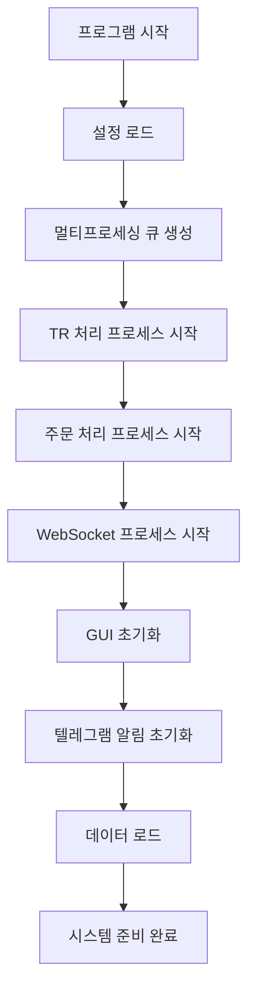

# 키움증권 자동매매 시스템 (Kiwoom Auto Trading System)

## 📋 목차

1. [프로젝트 개요](#-프로젝트-개요)
2. [시스템 아키텍처](#-시스템-아키텍처)
3. [핵심 기능](#-핵심-기능)
4. [디렉토리 구조](#-디렉토리-구조)
5. [각 모듈 상세 분석](#-각-모듈-상세-분석)
6. [시스템 작동 원리](#-시스템-작동-원리)
7. [데이터 흐름도](#-데이터-흐름도)
8. [설정 및 환경구성](#-설정-및-환경구성)
9. [실행 방법](#-실행-방법)
10. [주요 클래스 및 함수](#-주요-클래스-및-함수)
11. [확장 가능한 기능](#-확장-가능한-기능)
12. [트러블슈팅](#-트러블슈팅)

---

## 🎯 프로젝트 개요

**키움증권 REST API 기반 완전 자동화 주식매매 시스템**

본 프로젝트는 키움증권의 REST API와 WebSocket을 활용하여 완전히 자동화된 주식 매매 시스템입니다. 사용자 정의 조건식을 통해 자동 매수/매도를 수행하며, 고급 리스크 관리 기능과 실시간 알림 시스템을 제공합니다.

### 주요 특징
- **완전 자동화**: 사용자 개입 없이 조건식 기반 자동 매매
- **실시간 모니터링**: WebSocket 기반 실시간 시세 및 주문 처리
- **고급 리스크 관리**: 손절매, 트레일링 스톱, 재매수 방지
- **텔레그램 알림**: 모든 매매 상황을 실시간 알림
- **성과 분석**: 조건식별 성과 추적 및 분석
- **모의투자 지원**: 실전 투자 전 안전한 테스트 환경

---

## 🏗️ 시스템 아키텍처

```
┌─────────────────────────────────────────────────────────────┐
│                     키움증권 자동매매 시스템                      │
├─────────────────────────────────────────────────────────────┤
│  GUI (PyQt5)         │  멀티프로세싱 백엔드                    │
│  ┌─────────────┐     │  ┌─────────────┐ ┌──────────────┐   │
│  │ 메인 윈도우   │     │  │TR 처리 프로세스│ │주문 처리 프로세스│   │
│  │- 조건검색식 관리  │◄────┤  └─────────────┘ └──────────────┘   │
│  │- 매매 설정   │     │  ┌─────────────────────────────────┐   │
│  │- 실시간 모니터│     │  │     WebSocket 프로세스          │   │
│  └─────────────┘     │  │  - 실시간 시세 수신              │   │
├─────────────────────────────────────────────────────────────┤
│                외부 시스템 연동                               │
│  ┌─────────────┐ ┌─────────────┐ ┌─────────────────────┐   │
│  │키움 REST API│ │키움 WebSocket│ │텔레그램 알림 시스템      │   │
│  └─────────────┘ └─────────────┘ └─────────────────────┘   │
└─────────────────────────────────────────────────────────────┘
```

### 멀티프로세싱 구조
시스템은 4개의 독립적인 프로세스로 구성되어 안정성과 성능을 보장합니다:

1. **메인 GUI 프로세스**: 사용자 인터페이스 및 제어
2. **TR 처리 프로세스**: REST API 요청 처리 (계좌조회, 종목정보 등)
3. **주문 처리 프로세스**: 매수/매도 주문 전담 처리
4. **WebSocket 프로세스**: 실시간 데이터 수신 및 조건식 관리

---

## 🚀 핵심 기능

### 1. 지능형 자동매매
- **키움서버에 등록된 조건검색식 사용**: 키움서버에 만들어 놓은 조건검색식을 불러온다
- **다중 조건검색식 동시 운용**: 여러 매수 조건검색식을 시간대별로 관리
- **시간별 조건검색식 제어**: 각 조건검색식마다 독립적인 운영 시간 설정
- **당일 매도 종목 재매수 방지 체크 박스**: 손실 방지를 위한 고급 필터링
- **실시간 조건검색식 편입/편출**: 즉시 매수/매도 신호 처리

### 2. 고급 리스크 관리
- **손절매 시스템**: 설정 손실률 도달 시 자동 매도
- **트레일링 스톱**: 수익 구간에서 하락 시 자동 매도
- **포지션 사이즈 관리**: 최대 동시 보유 종목 수 제한
- **미체결 주문 관리**: 미체결 시간 초과 시 시장가 정정

### 3. 실시간 모니터링 및 알림
- **텔레그램 실시간 알림**: 모든 매매 상황을 즉시 알림
- **성과 추적 시스템**: 조건검색식별 승률 및 수익률 분석
- **실시간 대시보드**: 보유 종목 및 자동매매 현황 모니터링
- **로그 시스템**: 카테고리별 상세 로그 기록

### 4. 데이터 관리 및 분석
- **당일 매도 기록**: 완전한 매매 이력 관리
- **조건검색식별 성과 분석**: 각 조건검색식의 성과 통계
- **시간대별 패턴 분석**: 매도 시간 패턴 분석
- **백업 및 복원**: 자동 데이터 백업 시스템

---

## 📁 디렉토리 구조

```
kiwoom_actual/
├── 📄 main.py                          # 메인 실행 파일 (GUI)
├── 📄 log_analyzer.py                  # 로그 분석 도구
├── 📁 config/                          # 설정 파일
│   ├── 📄 config.py                    # 주요 설정 (API 키, 텔레그램 등)
│   └── 📄 __init__.py
├── 📁 func/                           # 핵심 기능 모듈
│   ├── 📄 tr_process_functions.py      # REST API 처리 함수
│   ├── 📄 websocket_functions.py       # WebSocket 처리 함수
│   └── 📄 __init__.py
├── 📁 utils/                          # 유틸리티 모듈
│   ├── 📄 enhanced_logging.py          # 고급 로깅 시스템
│   ├── 📄 telegram_notifier.py         # 텔레그램 알림 시스템
│   ├── 📄 utils.py                     # 공통 유틸리티 (KiwoomTR 클래스)
│   └── 📄 __init__.py
├── 📁 logs/                           # 로그 파일 저장소
│   ├── 📁 trading/                     # 매매 로그
│   ├── 📁 errors/                      # 에러 로그
│   ├── 📁 tr_requests/                 # API 요청 로그
│   ├── 📁 websocket/                   # WebSocket 로그
│   ├── 📁 orders/                      # 주문 로그
│   └── 📁 general/                     # 일반 로그
├── 📁 docs/                           # 문서 및 계획
│   ├── 📄 project_plan.md
│   ├── 📄 README.md
│   ├── 📄 모듈식 개선 및 확장성 계획.md
│   └── 📄 코드 리펙토링.md
└── 📊 데이터 파일들                      # 실행 시 생성되는 데이터
    ├── 📄 realtime_tracking_df.pkl     # 실시간 추적 데이터
    ├── 📄 sold_stocks_detail_YYYYMMDD.pkl  # 당일 매도 상세
    ├── 📄 condition_performance_YYYYMMDD.json  # 조건검색식 성과
    └── 📄 hourly_pattern_YYYYMMDD.csv  # 시간대별 패턴
```

---

## 🔍 각 모듈 상세 분석

### 📄 main.py - 메인 GUI 애플리케이션

**핵심 클래스:**
- `KiwoomAPI`: 메인 애플리케이션 클래스
- `BuyConditionModel`: 매수 조건식 관리 모델
- `PandasModel`: 테이블 표시용 모델
- `TimeSettingDialog`: 시간 설정 대화상자

**주요 기능:**
```python
class KiwoomAPI(QMainWindow):
    def __init__(self):
        # 멀티프로세싱 큐 초기화
        self.tr_req_queue = tr_req_queue          # TR 요청 큐
        self.tr_result_queue = tr_result_queue    # TR 결과 큐
        self.order_tr_req_queue = order_tr_req_queue  # 주문 요청 큐
        self.websocket_req_queue = websocket_req_queue  # WebSocket 요청 큐
        self.websocket_result_queue = websocket_result_queue  # WebSocket 결과 큐
        
        # 당일 매도 종목 관리 시스템 (64GB 메모리 활용)
        self.today_sold_stocks = set()            # 초고속 체크용 (0.1ms)
        self.today_sold_details = {}              # 상세 정보 (실시간 분석)
        self.today_sold_df = pd.DataFrame()       # 완전 기록 (통계/차트)
        
    def should_prevent_rebuy(self, 종목코드, condition_name):
        """고급 재매수 차단 로직"""
        # 1. 기본 당일 매도 종목 차단
        # 2. 손실 매도만 차단 옵션
        # 3. 같은 조건식만 차단 옵션
        # 4. 시간 간격 기반 차단
```

**UI 구성:**
- **제어 패널**: 자동매매 ON/OFF, 시간 설정, 미체결 관리
- **매수 설정**: 다중 조건검색식 관리, 재매수 방지 설정
- **매도 설정**: 손절매, 트레일링 스톱 설정
- **모니터링 탭**: 계좌 현황, 자동매매 현황, 당일 매도 현황

### 📄 config/config.py - 시스템 설정

```python
# API 연결 설정
is_paper_trading = True  # 모의투자 여부
api_key = "YOUR_API_KEY"
api_secret_key = "YOUR_SECRET_KEY"
host = "https://mockapi.kiwoom.com" if is_paper_trading else "https://api.kiwoom.com"

# 텔레그램 알림 설정
TELEGRAM_CONFIG = {
    "enabled": True,
    "bot_token": "YOUR_BOT_TOKEN",
    "chat_id": "YOUR_CHAT_ID",
    "alert_levels": {
        "buy_condition": True,   # 매수 조건 편입
        "buy_order": True,       # 매수 주문 접수
        "buy_filled": True,      # 매수 체결 완료
        # ... 기타 알림 설정
    }
}
```

### 📄 func/tr_process_functions.py - REST API 처리

```python
def tr_general_req_func(tr_req_in_queue: Queue, tr_req_out_queue: Queue):
    """TR 일반 요청 처리 프로세스"""
    kiwoom_tr = KiwoomTR()
    
    while True:
        data = tr_req_in_queue.get()
        
        if data['action_id'] == "계좌조회":
            # 1초 간격 제한으로 안정적 호출
            account_info_dict, df = kiwoom_tr.reqeust_all_account_info()
            tr_req_out_queue.put({
                'action_id': '계좌조회',
                'df': df,
                'account_info_dict': account_info_dict
            })
        
        elif data['action_id'] == "주식기본정보":
            # 종목 기본 정보 조회
            basic_info_dict = kiwoom_tr.fn_ka10007(params)
            # 결과를 큐에 전달
```

### 📄 func/websocket_functions.py - 실시간 데이터 처리

```python
class WebSocketClient:
    
    def __init__(self, uri='', req_in_queue=None, realtime_out_queue=None):
        self.uri = uri
        self.websocket = None
        self.connected = False
        self.keep_running = True
        kiwoom_tr = KiwoomTR()
        self.token = kiwoom_tr.token
        self.req_in_queue = req_in_queue
        self.realtime_out_queue = realtime_out_queue
        self.stock_code_to_group_num_dict = dict()
        self.group_num = 10
        self.reqeust_list = deque()
        log_websocket("WebSocketClient 초기화 완료")
        
    async def connect(self):
        try:
            log_websocket(f"웹소켓 서버 연결 시도: {self.uri}")
            self.websocket = await websockets.connect(self.uri)
            self.connected = True
            log_websocket("웹소켓 서버 연결 성공")

            # 로그인 패킷
            param = {
                'trnm': 'LOGIN',
                'token': self.token
            }

            log_websocket('실시간 시세 서버로 로그인 패킷 전송')
            # 웹소켓 연결 시 로그인 정보 전달
            await self.send_message(message=param)

        except Exception as e:
            log_error(f'웹소켓 연결 에러: {e}', exception=True)
            self.connected = False
            
    async def req_condition_name_list(self):
        log_websocket("조건식 리스트 요청")
        await self.send_message({
            'trnm': 'CNSRLST',  # TR명
        })
        
    async def receive_messages(self):
        """실시간 메시지 수신 및 처리"""
        while self.keep_running:
            response = json.loads(await self.websocket.recv())
            tr_name = response.get('trnm')
            
            if tr_name == "REAL":
                # 실시간 데이터 처리
                if chunk_data_info_map['name'] == "주문체결":
                    # 주문 체결 정보 처리
                    
                elif chunk_data_info_map['name'] == "주식체결":
                    # 실시간 시세 정보 처리
                    
                elif chunk_data_info_map['name'] == "조건검색":
                    # 조건식 편입/편출 처리
```

### 📄 utils/enhanced_logging.py - 고급 로깅 시스템

```python
class EnhancedLogger:
    def setup_loggers(self):
        """카테고리별 로거 설정"""
        # 1. 콘솔 출력 (모든 로그)
        # 2. 전체 로그 (일반) - 30일 보관
        # 3. 에러 로그 - 90일 보관
        # 4. 매매 로그 - 365일 보관 (중요!)
        # 5. TR 요청 로그 - 30일 보관
        # 6. 웹소켓 로그 - 30일 보관
        # 7. 주문 로그 - 180일 보관

# 편의 함수들
def log_trading(message, level="INFO"):    # 매매 관련 로그
def log_tr_request(message, level="DEBUG"): # TR 요청 관련 로그
def log_websocket(message, level="DEBUG"):  # 웹소켓 관련 로그
def log_order(message, level="INFO"):      # 주문 관련 로그
```

### 📄 utils/telegram_notifier.py - 텔레그램 알림 시스템

```python
class TelegramNotifier:
    def __init__(self, bot_token, chat_id, config=None):
        # 스팸 방지 메시지 큐
        self.message_queue = Queue()
        self.message_history = deque(maxlen=100)
        
        # 메시지 전송 쓰레드 시작
        self.sender_thread = threading.Thread(target=self._message_sender)
        
    def send_buy_condition_alert(self, ...):
        """매수 조건 편입 알림"""
        message = f"""🟢 [매수 조건 편입]
📊 종목: {stock_name}({stock_code})
🎯 조건식: "{condition_name}"
💰 현재가: {current_price:,}원"""
        
    def send_sell_filled_alert(self, ...):
        """매도 체결 완료 알림"""
        profit_emoji = "🎉" if profit_rate > 0 else "😢"
        # 상세한 매도 정보 전송
```

### 📄 utils/utils.py - 공통 유틸리티

```python
class KiwoomTR:
    def __init__(self):
        log_info("KiwoomTR 초기화 시작")
        self.token = self.login()
        log_info("KiwoomTR 초기화 완료")
        
    def login():
        log_tr_request("토큰 발급 요청 시작")
        params = {
            'grant_type': 'client_credentials',  # grant_type
            'appkey': api_key,  # 앱키
            'secretkey': api_secret_key,  # 시크릿키
        }
        endpoint = '/oauth2/token'
        url = host + endpoint
        headers = {
            'Content-Type': 'application/json;charset=UTF-8',  # 컨텐츠타입
        }
    
        try:
            response = requests.post(url, headers=headers, json=params)
            response.raise_for_status()
            token = response.json()['token']
            log_tr_request("토큰 발급 성공")
            return token
        except requests.HTTPError as e:
            error_message = f"HTTP Error: {e}\nResponse Body: {response.text}"
            log_error(f"토큰 발급 실패: {error_message}")
            raise requests.HTTPError(error_message) from e
        
    def fn_ka10099(self, data, cont_yn='N', next_key=''):
        """종목정보 리스트 요청"""
        # 종목 정보 조회
    
    def fn_ka10086(self, data, cont_yn='N', next_key=''):
        """일별주가 요청"""
        # 일별 주가 조회
        
    def fn_kt00018(self, data, cont_yn='N', next_key=''):
        """계좌평가잔고내역 요청"""
        # 보유 종목 정보 조회
        
    def fn_ka10007(self, data, cont_yn='N', next_key=''):
        """시세표성정보요청"""
        # 종목 기본 정보 조회
        
    def fn_kt10000(self, data, cont_yn='N', next_key=''):
        """매수 주문"""
        # 매수 주문 처리
        
    def fn_kt10001(self, data, cont_yn='N', next_key=''):
        """매도 주문"""
        # 매도 주문 처리
        
    def fn_kt10002(self, data, cont_yn='N', next_key=''):
        """정정 주문"""
        # 정정 주문 처리
        
    def fn_kt10003(self, data, cont_yn='N', next_key=''):
        """취소 주문"""
        # 취소 주문 처리
        
    def fn_ka10027(self, data, cont_yn='N', next_key=''):
        """전일대비등락률상위요청"""
        # 전일대비 등락률 상위 종목 조회

    def reqeust_all_account_info(self):
        """모든 계좌 정보 요청"""
        # 계좌정보 연속 조회

```

---

## ⚙️ 시스템 작동 원리

### 1. 시스템 초기화 과정



### 2. 자동매매 실행 과정

#### A. 매수 프로세스
```
1. 조건검색식 실시간 등록
   ↓
2. WebSocket으로 편입 신호 수신
   ↓
3. 당일 매도 종목 재매수 차단 검사
   ↓
4. 거래 시간 및 제한 조건 검사
   ↓
5. 종목 기본정보 요청 (TR)
   ↓
6. 매수 주문 전송
   ↓
7. 텔레그램 알림 전송
   ↓
8. 실시간 추적 시작
```

#### B. 매도 프로세스
```
1. 실시간 시세 모니터링
   ↓
2. 매도 조건 검사
   - 손절매 조건 (-2% 이하)
   - 트레일링 스탑 (고가 대비 -1% 하락)
   - 매도 조건검색식 편입
   ↓
3. 매도 주문 전송
   ↓
4. 당일 매도 종목 기록
   ↓
5. 텔레그램 알림 전송
   ↓
6. 성과 분석 데이터 업데이트
```

### 3. 당일 매도 종목 재매수 방지 시스템

```python
def should_prevent_rebuy(self, 종목코드, condition_name):
    """64GB 메모리를 활용한 초고속 재매수 차단"""
    
    # 1단계: 0.1ms 초고속 체크
    if 종목코드 not in self.today_sold_stocks:
        return False  # 매수 허용
    
    # 2단계: 상세 조건 검사 (1ms)
    prev_trade = self.today_sold_details[종목코드]
    
    # 옵션 1: 손실 매도만 차단
    if self.preventLossRebuyOnlyCheckBox.isChecked():
        return prev_trade["수익률"] < 0
    
    # 옵션 2: 같은 조건식만 차단
    if self.preventSameConditionOnlyCheckBox.isChecked():
        return prev_trade["매수조건식"] == condition_name
    
    # 옵션 3: 시간 간격 체크
    time_diff = (datetime.datetime.now() - prev_trade["매도시간"]).seconds
    if time_diff < self.rebuyTimeoutSpinBox.value() * 60:
        return True
    
    return True  # 기본: 모든 당일 매도 종목 차단
```

### 4. 멀티프로세싱 통신 구조

```
GUI 프로세스 ←→ Queue ←→ TR 처리 프로세스
     ↓                        ↑
     ↓                        ↑
WebSocket 프로세스 ←→ Queue ←→ 주문 처리 프로세스
```

**큐별 역할:**
- `tr_req_queue`: GUI → TR 프로세스 (계좌조회, 종목정보 요청)
- `tr_result_queue`: TR 프로세스 → GUI (조회 결과)
- `order_tr_req_queue`: GUI → 주문 프로세스 (매수/매도 주문)
- `websocket_req_queue`: GUI → WebSocket (실시간 등록/해제)
- `websocket_result_queue`: WebSocket → GUI (실시간 데이터)

---

## 📊 데이터 흐름도

### 실시간 데이터 처리 흐름

```
키움 WebSocket 서버
         ↓
WebSocket 프로세스 (조건검색식 편입/편출, 실시간 시세)
         ↓
websocket_result_queue
         ↓
GUI 메인 프로세스
         ↓
매매 로직 처리 (재매수 차단, 손절매, 트레일링)
         ↓
order_tr_req_queue
         ↓
주문 처리 프로세스
         ↓
키움 REST API 서버
```

### 데이터 저장 구조

```python
# 1. 실시간 추적 데이터 (realtime_tracking_df.pkl)
실시간_추적_DF = {
    "종목코드": ["005930", "000660", ...],
    "종목명": ["삼성전자", "SK하이닉스", ...],
    "현재가": [75000, 85000, ...],
    "매입가": [74000, 86000, ...],
    "수익률(%)": [1.35, -1.16, ...],
    "매수조건식명": ["급등주_포착", "기술적_반등", ...],
    "매도사유": [None, "손절", ...]
}

# 2. 당일 매도 상세 (sold_stocks_detail_YYYYMMDD.pkl)
당일_매도_DF = {
    "종목코드": ["005930", "000660"],
    "종목명": ["삼성전자", "SK하이닉스"], 
    "매도시간": [datetime.datetime(2024, 8, 3, 14, 30, 15), ...],
    "매수조건식": ["급등주_포착", "기술적_반등"],
    "매도사유": ["손절", "트레일링"],
    "수익률": [-2.1, 3.5],
    "매도금액": [148000, 255000]
}

# 3. 조건식별 성과 (condition_performance_YYYYMMDD.json)
조건식_성과 = {
    "급등주_포착": {
        "거래수": 15,
        "평균수익률": 2.3,
        "승률": 73.3
    },
    "기술적_반등": {
        "거래수": 8,
        "평균수익률": -0.8,
        "승률": 37.5
    }
}
```

---

## ⚙️ 설정 및 환경구성

### 1. 필수 라이브러리 설치

```bash
pip install PyQt5
pip install pandas
pip install requests
pip install websockets
pip install loguru
```

### 2. config/config.py 설정

```python
# 1. 키움증권 API 설정 (각 키값은 각각의 계좌마다 다름, 한개의 계좌에 API_KEY 1개, SECRET_KEY 1개)
is_paper_trading = True  # 모의투자 시작 시 True
api_key = "발급받은_API_KEY"
api_secret_key = "발급받은_SECRET_KEY"

# 2. 텔레그램 봇 설정 (선택사항)
TELEGRAM_CONFIG = {
    "enabled": True,
    "bot_token": "봇파더에서_발급받은_토큰",
    "chat_id": "본인의_채팅ID"
}
```

### 3. 텔레그램 봇 설정 (선택사항)

1. **텔레그램에서 @BotFather 검색**
2. `/newbot` 명령어로 봇 생성
3. 봇 토큰 복사하여 config.py에 입력
4. 본인과 봇 채팅방에서 `/start` 입력
5. `https://api.telegram.org/bot{BOT_TOKEN}/getUpdates`로 chat_id 확인

### 4. 키움증권 API 신청

1. 키움증권 홈페이지 → REAS API 신청
2. 모의투자 계좌 개설
3. API Key 및 Secret Key 발급
4. 조건검색식 등록 (HTS에서 미리 등록 필요)

---

## 🚀 실행 방법

### 1. 기본 실행

```bash
# 메인 프로그램 실행
python main.py
```

### 2. 초기 설정 순서

1. **조건검색식 설정**
   - 키움 HTS에서 조건검색식 미리 등록
   - 프로그램에서 "매수 설정" → "조건식 추가" 클릭
   - 원하는 조건식 선택 후 시간 설정

2. **매수/매도 설정**
   - 매수 금액 설정 (기본: 200,000원)
   - 손절매 비율 설정 (기본: -2%)
   - 트레일링 스탑 설정 (기본: +2% 발동, -1% 매도)

3. **자동매매 시작**
   - "자동매매 ON" 버튼 클릭
   - 조건식 실시간 등록 확인
   - 텔레그램 알림 테스트

### 3. 모니터링 방법

- **계좌 현황 탭**: 현재 보유 종목 실시간 확인
- **자동매매 현황 탭**: 조건검색식으로 편입된 종목 모니터링
- **당일 매도 현황 탭**: 당일 매도된 종목 통계 확인
- **텔레그램 알림**: 모든 매매 상황 실시간 수신

---

## 🔧 주요 클래스 및 함수

### 1. 핵심 클래스

#### KiwoomAPI (main.py)
```python
class KiwoomAPI(QMainWindow):
    """메인 애플리케이션 클래스"""
    
    def auto_trade_on(self):
        """자동매매 시작"""
        # 1. 매수 조건검색식들 실시간 등록
        # 2. 매도 조건검색식 실시간 등록  
        # 3. 거래 플래그 활성화
        
    def on_receive_realtime_condition_event(self, data):
        """실시간 조건식 이벤트 처리"""
        # 1. 조건검색식별 시간 확인
        # 2. 당일 매도 종목 재매수 차단
        # 3. 매수 진행 또는 차단
        
    def should_prevent_rebuy(self, 종목코드, condition_name):
        """재매수 차단 로직"""
        # 고급 재매수 차단 알고리즘
```

#### BuyConditionModel (main.py)
```python
class BuyConditionModel(QAbstractTableModel):
    """매수 조건검색식 관리 모델"""
    
    def add_condition(self, condition_name, condition_index, start_time, end_time):
        """조건검색식 추가"""
        
    def update_time(self, row, start_time, end_time):
        """시간 업데이트"""
        
    def toggle_active(self, row):
        """활성화 상태 토글"""
```

#### WebSocketClient (func/websocket_functions.py)
```python
class WebSocketClient:
    """WebSocket 클라이언트"""
    
    async def receive_messages(self):
        """실시간 메시지 수신"""
        # 조건검색, 주문체결, 주식체결 처리
        
    async def register_condition_realtime_result(self, condition_idx):
        """조건검색식 실시간 등록"""
        
    async def register_realtime_group(self, stock_code):
        """종목 실시간 등록"""
```

#### TelegramNotifier (utils/telegram_notifier.py)
```python
class TelegramNotifier:
    """텔레그램 알림 시스템"""
    
    def send_buy_condition_alert(self, ...):
        """매수 조건 편입 알림"""
        
    def send_sell_filled_alert(self, ...):
        """매도 체결 완료 알림"""
        
    def _should_send_message(self, stock_code, message_type, cooldown_seconds):
        """스팸 방지 로직"""
```

### 2. 핵심 함수

#### 매매 관련 함수
```python
def sell_order(self, 종목코드):
    """매도 주문 처리"""
    # 1. 보유 수량 확인
    # 2. 주문 방식 결정 (시장가/지정가)
    # 3. 주문 큐에 전송
    
def on_receive_order_result(self, data):
    """주문 결과 처리"""
    # 1. 주문 접수/체결 구분
    # 2. 당일 매도 종목 기록
    # 3. 텔레그램 알림 전송
    
def on_realtime_tracking_df_update(self, 종목코드, 현재가, 수익률):
    """실시간 추적 데이터 업데이트"""
    # 1. 손절매 조건 확인
    # 2. 트레일링 스탑 로직
    # 3. 매도 신호 발생 시 주문
```

#### 데이터 관리 함수
```python
def load_today_sold_stocks(self):
    """당일 매도 종목 데이터 로드"""
    # 시스템 재시작 시 당일 매도 기록 복원
    
def save_comprehensive_report(self):
    """종합 리포트 저장"""
    # 프로그램 종료 시 모든 데이터 저장
    
def get_condition_performance_summary(self):
    """조건검색식별 성과 요약"""
    # 조건검색식별 거래 성과 분석
```

---

## 🎛️ 확장 가능한 기능

### 1. 추가 가능한 매도 조건

```python
# 시간 기반 매도
def check_time_based_sell(self, 종목코드):
    """보유 시간 기반 매도"""
    holding_time = get_holding_time(종목코드)
    if holding_time > self.max_holding_minutes:
        return True

# 거래량 기반 매도  
def check_volume_based_sell(self, 종목코드):
    """거래량 급증 시 매도"""
    current_volume = get_current_volume(종목코드)
    avg_volume = get_average_volume(종목코드, days=20)
    if current_volume > avg_volume * 3:
        return True

# 기술적 지표 기반 매도
def check_technical_sell(self, 종목코드):
    """RSI, MACD 등 기술적 지표 기반 매도"""
    rsi = calculate_rsi(종목코드)
    if rsi > 80:  # 과매수 구간
        return True
```

### 2. 포트폴리오 관리 기능

```python
class PortfolioManager:
    """포트폴리오 관리자"""
    
    def calculate_portfolio_risk(self):
        """포트폴리오 리스크 계산"""
        
    def rebalance_positions(self):
        """포지션 리밸런싱"""
        
    def check_sector_concentration(self):
        """섹터 집중도 확인"""
```

### 3. 백테스팅 시스템

```python
class BacktestEngine:
    """백테스팅 엔진"""
    
    def run_backtest(self, start_date, end_date, conditions):
        """과거 데이터로 전략 백테스팅"""
        
    def calculate_performance_metrics(self):
        """성과 지표 계산 (샤프 비율, MDD 등)"""
```

### 4. 알림 채널 확장

```python
class MultiChannelNotifier:
    """다중 채널 알림 시스템"""
    
    def send_email_alert(self, ...):
        """이메일 알림"""
        
    def send_slack_alert(self, ...):
        """슬랙 알림"""
        
    def send_discord_alert(self, ...):
        """디스코드 알림"""
```

---

## 🔧 트러블슈팅

### 1. 일반적인 문제

#### Q: 조건검색식이 표시되지 않습니다.
**A:** 
1. 키움 HTS에서 조건검색식이 정상 등록되었는지 확인
2. API 토큰이 유효한지 확인 (1일마다 갱신 필요)
3. 프로그램 재시작 후 재시도

#### Q: 주문이 접수되지 않습니다.
**A:**
1. 모의투자 계좌 잔고 확인
2. 장 시간 여부 확인 (9:00~15:30)
3. 주문 큐 프로세스 상태 확인
4. logs/orders/ 폴더의 로그 파일 확인

#### Q: 텔레그램 알림이 오지 않습니다.
**A:**
1. config.py의 bot_token과 chat_id 확인
2. 봇과 대화방에서 /start 명령어 실행
3. 텔레그램 연결 테스트 실행
4. logs/errors/ 폴더의 에러 로그 확인

### 2. 성능 최적화

#### 메모리 사용량 모니터링
```python
import psutil

def monitor_memory_usage():
    """메모리 사용량 모니터링"""
    process = psutil.Process()
    memory_info = process.memory_info()
    print(f"메모리 사용량: {memory_info.rss / 1024 / 1024:.1f} MB")
```

#### 큐 크기 모니터링
```python
def monitor_queue_sizes(self):
    """큐 크기 모니터링"""
    print(f"TR 요청 큐: {self.tr_req_queue.qsize()}")
    print(f"주문 요청 큐: {self.order_tr_req_queue.qsize()}")
    print(f"WebSocket 요청 큐: {self.websocket_req_queue.qsize()}")
```

### 3. 로그 분석

#### 로그 레벨별 분석
```bash
# 에러 로그만 확인
grep "ERROR" logs/general/app_20240803.log

# 매매 관련 로그만 확인  
grep "TRADING" logs/trading/trading_20240803.log

# 특정 종목 로그 검색
grep "005930" logs/trading/trading_20240803.log
```

#### 성과 분석 스크립트
```python
def analyze_daily_performance():
    """일일 성과 분석"""
    # condition_performance_YYYYMMDD.json 파일 분석
    # 조건식별 승률, 평균 수익률 계산
    # 시간대별 매매 패턴 분석
```

---

## 📈 시스템 모니터링 및 유지보수

### 1. 일일 점검사항

- [ ] 로그 파일 용량 확인 (logs/ 디렉토리)
- [ ] 당일 매매 실적 확인 (당일 매도 현황 탭)
- [ ] 조건식별 성과 확인 (condition_performance_*.json)
- [ ] 텔레그램 알림 정상 작동 확인
- [ ] 메모리 사용량 확인 (태스크 매니저)

### 2. 주간 점검사항

- [ ] 조건식 성과 분석 및 개선
- [ ] 손절매/트레일링 스탑 비율 최적화
- [ ] 재매수 방지 설정 효과 분석
- [ ] 로그 파일 백업 및 정리

### 3. 월간 점검사항

- [ ] 전체 성과 백테스팅
- [ ] 시스템 설정 최적화
- [ ] 새로운 조건식 발굴 및 테스트
- [ ] 하드웨어 리소스 점검

---

## 📚 추가 자료

### 관련 문서
- `docs/project_plan.md`: 프로젝트 계획서
- `docs/모듈식 개선 및 확장성 계획.md`: 확장 계획
- `docs/코드 리펙토링.md`: 리펙토링 가이드

### 참고 링크
- [키움증권 Open API 가이드](https://www3.kiwoom.com/nkw.templateFrameSet.do?m=m1408000000)
- [PyQt5 공식 문서](https://doc.qt.io/qtforpython/)
- [텔레그램 봇 API](https://core.telegram.org/bots/api)

---

**⚠️ 주의사항**
- 실전 투자 전 반드시 모의투자로 충분한 테스트 필요
- 리스크 관리 설정을 신중하게 검토
- 과도한 매매 빈도는 수수료 부담 증가
- 시장 상황에 따른 조건식 성과 차이 고려

**📞 지원**
- 이슈 발생 시 logs/ 디렉토리의 에러 로그 확인
- 설정 관련 문의는 config/config.py 파일 검토
- 성과 개선을 위한 조건식 최적화 권장