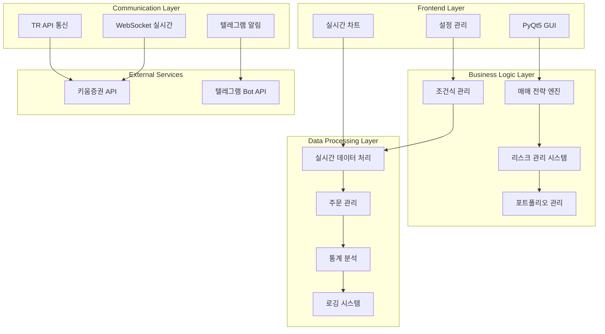
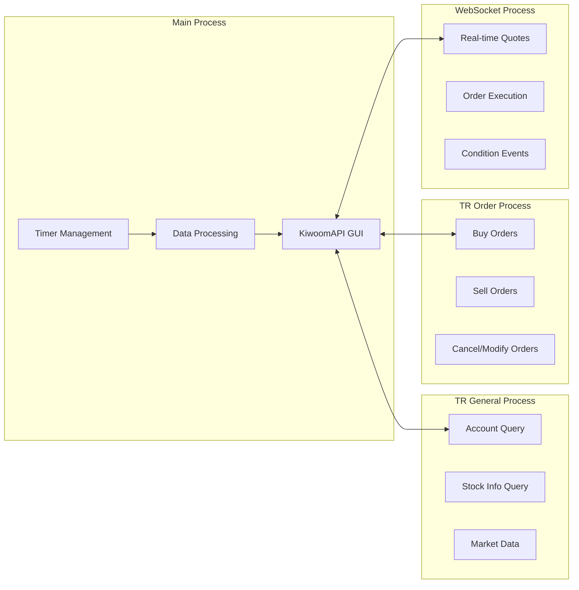

# 키움증권 자동매매 프로그램 - 상세 프로젝트 계획

## 🎯 프로젝트 목표

### 비전
키움증권 API를 활용한 **지능형 자동매매 시스템** 구축으로, 안정적이고 수익성 높은 알고리즘 트레이딩 환경 제공

### 핵심 목표
1. **안정성**: 24/7 무중단 운영 가능한 견고한 시스템
2. **수익성**: 다양한 매매 전략을 통한 수익 극대화
3. **리스크 관리**: 첨단 리스크 관리 시스템으로 손실 최소화
4. **사용성**: 직관적인 GUI와 실시간 모니터링
5. **확장성**: 새로운 전략과 기능 추가 용이한 모듈러 구조

## 🏗️ 시스템 아키텍처 상세

### 1. 전체 시스템 구조



### 2. 멀티프로세스 아키텍처



## 📋 기능 명세서

### 1. 핵심 기능

#### A. 조건식 기반 매매
- **다중 조건식 지원**: 최대 20개 조건식 동시 운영
- **시간대별 제어**: 조건식별 거래 시간 설정
- **실시간 편입/편출**: WebSocket 기반 즉시 반응
- **백테스팅**: 과거 데이터 기반 성과 검증

#### B. 고급 리스크 관리
- **동적 손절**: 변동성 기반 손절률 자동 조정
- **트레일링 스탑**: 다단계 트레일링 스탑 지원
- **포지션 사이징**: 켈리 공식 기반 포지션 크기 결정
- **재매수 방지**: 지능형 재매수 차단 시스템

#### C. 실시간 모니터링
- **대시보드**: 실시간 수익률, 포지션 현황
- **차트 연동**: TradingView 스타일 차트
- **알림 시스템**: 다채널 알림 (텔레그램, 이메일, SMS)
- **로그 분석**: ELK 스택 연동 로그 분석

### 2. 추가 기능

#### A. 인공지능 기능
- **패턴 인식**: 차트 패턴 자동 인식
- **감정 분석**: 뉴스/소셜미디어 감정 분석
- **예측 모델**: LSTM 기반 주가 예측
- **최적화**: 유전 알고리즘 기반 파라미터 최적화

#### B. 데이터 분석
- **성과 분석**: 샤프 비율, 최대 낙폭 등
- **리스크 측정**: VaR, CVaR 계산
- **백테스팅**: 몬테카를로 시뮬레이션
- **리포팅**: 자동 일/주/월 리포트 생성

## 📅 개발 로드맵

### Phase 1: 기반 시스템 구축 (완료)
- [x] 기본 GUI 인터페이스
- [x] 키움 API 연동
- [x] 멀티프로세스 아키텍처
- [x] 기본 로깅 시스템
- [x] 텔레그램 알림 연동

### Phase 2: 핵심 매매 기능 (완료)
- [x] 조건식 기반 매수/매도
- [x] 실시간 시세 처리
- [x] 주문 관리 시스템
- [x] 기본 리스크 관리
- [x] 데이터 영속성

### Phase 3: 고급 기능 개발 (진행 중)
- [x] 당일 매도 종목 재매수 방지
- [x] 트레일링 스탑 시스템
- [x] 상세 통계 및 분석
- [ ] 백테스팅 엔진
- [ ] 성과 분석 도구

### Phase 4: 지능화 및 최적화 (계획)
- [ ] 머신러닝 기반 신호 생성
- [ ] 동적 파라미터 최적화
- [ ] 포트폴리오 최적화
- [ ] 리스크 패리티 전략
- [ ] 다중 자산 지원

### Phase 5: 고도화 및 확장 (계획)
- [ ] 클라우드 배포
- [ ] 모바일 앱 연동
- [ ] API 서비스 제공
- [ ] 커뮤니티 기능
- [ ] 전략 마켓플레이스

## 🛠️ 기술 스택

### Backend
- **언어**: Python 3.8+
- **GUI**: PyQt5
- **비동기**: asyncio, websockets
- **데이터**: pandas, numpy
- **로깅**: loguru
- **통신**: requests, urllib3

### AI/ML (계획)
- **프레임워크**: TensorFlow, PyTorch
- **데이터 분석**: scikit-learn
- **시각화**: matplotlib, plotly
- **백테스팅**: backtrader, zipline

### Infrastructure (계획)
- **컨테이너**: Docker, Kubernetes
- **데이터베이스**: PostgreSQL, Redis
- **모니터링**: Prometheus, Grafana
- **로그 분석**: ELK Stack

## 📊 성능 목표

### 1. 시스템 성능
- **응답 시간**: 실시간 신호 처리 < 100ms
- **처리량**: 초당 1000건 이상 시세 처리
- **가용성**: 99.9% 업타임
- **메모리**: 상주 메모리 < 2GB

### 2. 매매 성능
- **수익률**: 연 20% 목표 수익률
- **샤프 비율**: 1.5 이상
- **최대 낙폭**: 15% 이하
- **승률**: 60% 이상

### 3. 리스크 관리
- **일일 VaR**: 포트폴리오의 2% 이하
- **포지션 집중도**: 단일 종목 10% 이하
- **섹터 집중도**: 단일 섹터 30% 이하

## 🔧 개발 환경 구성

### 1. 로컬 개발 환경

```bash
# 가상환경 생성
python -m venv venv
source venv/bin/activate  # Windows: venv\Scripts\activate

# 의존성 설치
pip install -r requirements.txt

# 개발 도구 설치
pip install pytest black flake8 mypy

# 환경 변수 설정
export KIWOOM_API_KEY="your_api_key"
export KIWOOM_SECRET_KEY="your_secret_key"
export TELEGRAM_BOT_TOKEN="your_bot_token"
```

### 2. 프로젝트 구조

```
project/
├── main_2.py                 # 메인 애플리케이션
├── requirements.txt          # Python 의존성
├── pytest.ini              # 테스트 설정
├── pyproject.toml           # 프로젝트 메타데이터
├── utils/                   # 유틸리티 모듈
│   ├── enhanced_logging.py  # 로깅 시스템
│   ├── telegram_notifier.py # 알림 시스템
│   └── utils.py             # API 래퍼
├── func/                    # 핵심 기능
│   ├── tr_process_functions.py
│   └── websocket_functions.py
├── config/                  # 설정 파일
│   └── config.py
├── tests/                   # 단위 테스트
│   ├── test_trading.py
│   ├── test_api.py
│   └── test_notifications.py
├── docs/                    # 문서
│   ├── api_reference.md
│   ├── user_guide.md
│   └── deployment.md
├── logs/                    # 로그 디렉토리
└── data/                    # 데이터 저장
    ├── backtest/
    ├── live/
    └── reports/
```

## 🧪 테스트 전략

### 1. 단위 테스트
```python
# 핵심 로직 테스트
def test_should_prevent_rebuy():
    """재매수 방지 로직 테스트"""
    
def test_trailing_stop_logic():
    """트레일링 스탑 로직 테스트"""
    
def test_position_sizing():
    """포지션 사이징 테스트"""
```

### 2. 통합 테스트
- API 연동 테스트
- 실시간 데이터 처리 테스트
- 주문 체결 테스트
- 알림 시스템 테스트

### 3. 부하 테스트
- 대량 시세 데이터 처리
- 동시 주문 처리
- 메모리 리크 테스트
- 장시간 운영 테스트

### 4. 백테스팅
- 과거 데이터 기반 성과 검증
- 다양한 시장 상황 테스트
- 극한 상황 스트레스 테스트

## 📈 모니터링 및 알림

### 1. 시스템 모니터링

```python
# 핵심 메트릭
metrics = {
    'system_health': {
        'cpu_usage': '<80%',
        'memory_usage': '<70%',
        'disk_usage': '<80%'
    },
    'trading_metrics': {
        'total_positions': 'current_count',
        'daily_pnl': 'realized + unrealized',
        'order_success_rate': '>95%'
    },
    'api_metrics': {
        'api_call_latency': '<200ms',
        'websocket_uptime': '>99%',
        'error_rate': '<1%'
    }
}
```

### 2. 알림 시스템

#### 긴급 알림 (즉시)
- 시스템 오류
- 큰 손실 발생
- API 연결 장애
- 비정상적 매매 패턴

#### 정보 알림 (배치)
- 일일 매매 요약
- 주간 성과 리포트
- 시스템 상태 체크
- 전략 성과 분석

### 3. 대시보드

```python
# 실시간 대시보드 요소
dashboard_elements = {
    'portfolio_value': '실시간 포트폴리오 가치',
    'daily_pnl': '일일 손익',
    'position_list': '현재 포지션 목록',
    'recent_trades': '최근 거래 내역',
    'system_status': '시스템 상태',
    'market_overview': '시장 개요'
}
```

## 🚀 배포 및 운영

### 1. 배포 전략

#### 개발 환경
- 로컬 개발
- 모의투자 테스트
- 단위/통합 테스트

#### 스테이징 환경
- 실제 데이터, 모의 거래
- 성능 테스트
- 사용자 승인 테스트

#### 프로덕션 환경
- 실제 거래
- 24/7 모니터링
- 자동 장애 복구

### 2. CI/CD 파이프라인 (계획)

```yaml
# .github/workflows/deploy.yml
name: Deploy Trading System
on:
  push:
    branches: [main]
jobs:
  test:
    runs-on: ubuntu-latest
    steps:
      - uses: actions/checkout@v2
      - name: Run tests
        run: pytest
      - name: Security scan
        run: bandit -r .
  deploy:
    needs: test
    runs-on: ubuntu-latest
    steps:
      - name: Deploy to staging
        run: ./deploy.sh staging
      - name: Integration tests
        run: ./integration_tests.sh
      - name: Deploy to production
        run: ./deploy.sh production
```

### 3. 운영 체크리스트

#### 일일 점검
- [ ] 시스템 상태 확인
- [ ] 매매 결과 검토
- [ ] 로그 에러 확인
- [ ] 포트폴리오 리밸런싱

#### 주간 점검
- [ ] 성과 분석 리포트
- [ ] 전략 파라미터 검토
- [ ] 시스템 리소스 분석
- [ ] 백업 데이터 검증

#### 월간 점검
- [ ] 전반적 성과 평가
- [ ] 전략 개선사항 도출
- [ ] 시스템 업그레이드 계획
- [ ] 리스크 관리 검토

## 🔒 보안 및 규정 준수

### 1. 보안 측면

- **API 키 관리**: 환경 변수 또는 암호화된 설정 파일
- **데이터 암호화**: 민감한 데이터 AES-256 암호화
- **접근 제어**: 다단계 인증 (MFA)
- **감사 로깅**: 모든 거래 및 설정 변경 기록

### 2. 규정 준수

- **금융투자업법** 준수
- **개인정보보호법** 준수
- **데이터 보관**: 5년간 거래 기록 보관
- **리스크 공시**: 투자 위험 고지

## 📚 문서화 계획

### 1. 기술 문서
- API 레퍼런스
- 아키텍처 가이드
- 배포 가이드
- 트러블슈팅 가이드

### 2. 사용자 문서
- 사용자 매뉴얼
- 설정 가이드
- FAQ
- 전략 개발 가이드

### 3. 개발자 문서
- 코딩 컨벤션
- 기여 가이드라인
- 코드 리뷰 가이드
- 성능 최적화 가이드

## 💰 비용 및 리소스 계획

### 1. 개발 비용
- 개발자 인건비: 월 500만원 × 6개월
- 인프라 비용: 월 50만원
- 도구 및 라이선스: 200만원
- **총 개발 비용: 약 3200만원**

### 2. 운영 비용 (월간)
- 서버 비용: 30만원
- API 비용: 10만원
- 모니터링 도구: 20만원
- **총 운영 비용: 월 60만원**

### 3. ROI 분석
- 목표 수익률: 연 20%
- 운용 자본: 1억원
- 연간 예상 수익: 2000만원
- **투자 회수 기간: 약 1.6년**

## 🎉 성공 지표

### 1. 기술적 성공 지표
- 시스템 가동률 99.9% 달성
- 평균 응답 시간 100ms 이하
- 일일 거래량 100건 이상 처리
- 제로 보안 사고

### 2. 비즈니스 성공 지표
- 연간 수익률 20% 달성
- 최대 낙폭 15% 이하 유지
- 월 활성 사용자 100명 이상
- 고객 만족도 4.5/5.0 이상

### 3. 장기 목표
- 오픈 소스 커뮤니티 구축
- 상용 서비스 런칭
- 금융 기관 파트너십
- 글로벌 시장 진출

---

**🎯 이 프로젝트는 단순한 자동매매 프로그램을 넘어서, 차세대 지능형 투자 플랫폼으로 발전시키는 것이 최종 목표입니다.**