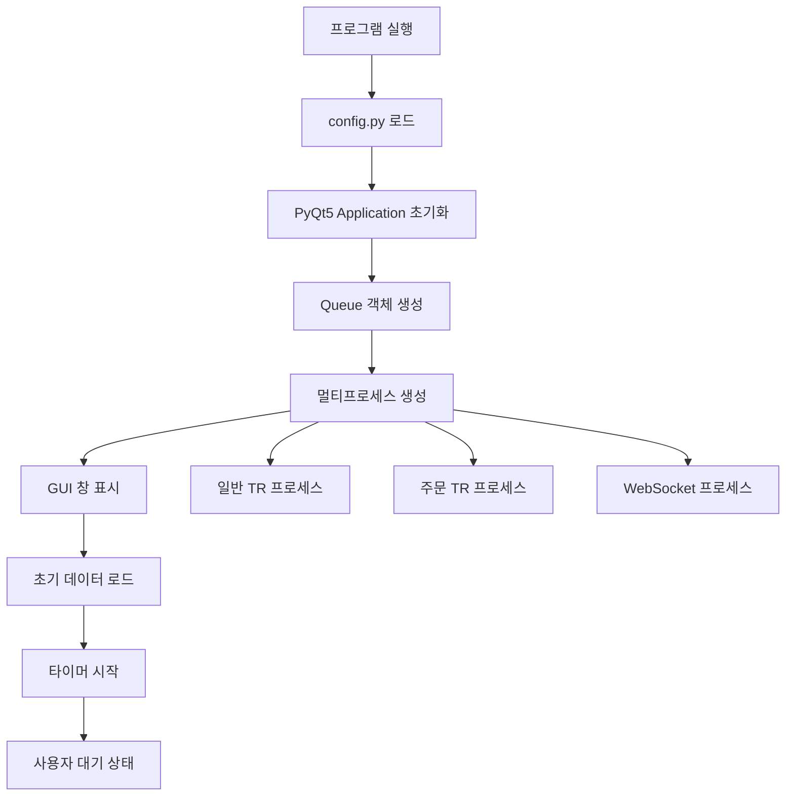
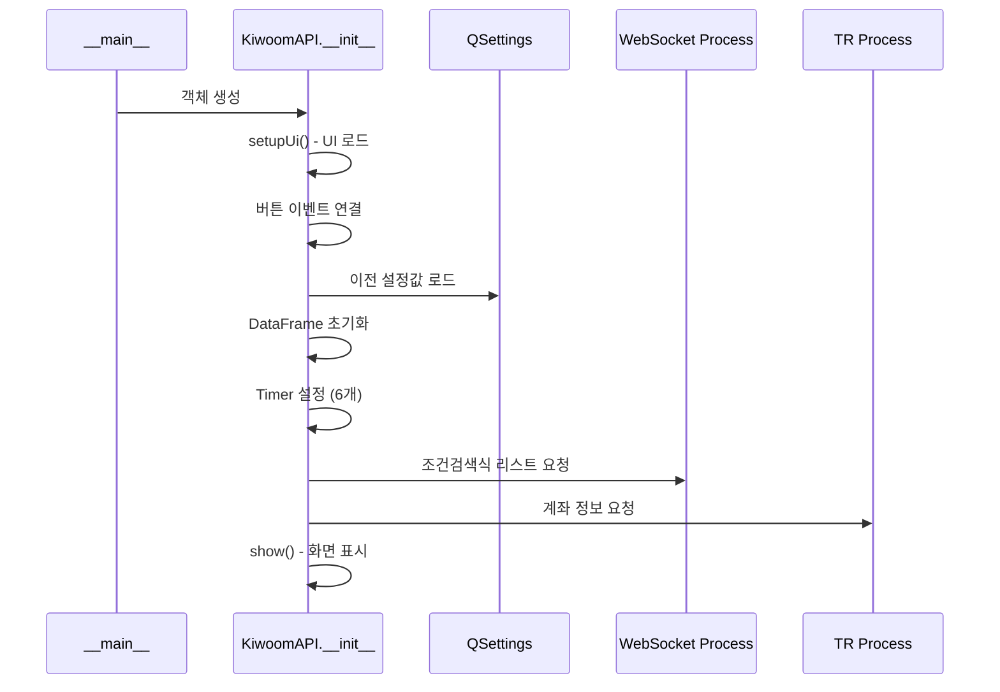
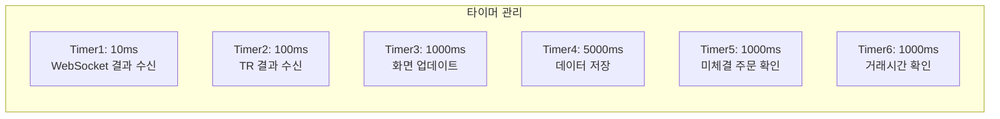
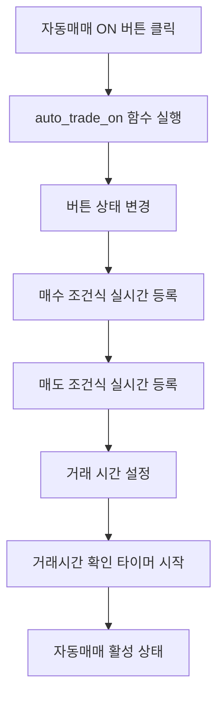
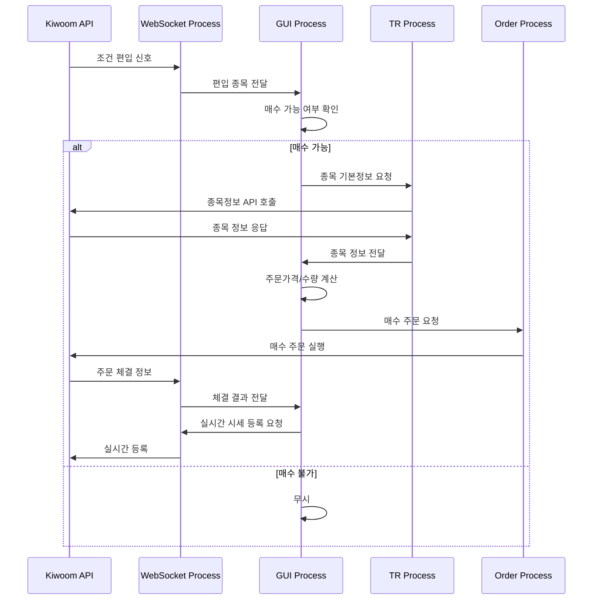
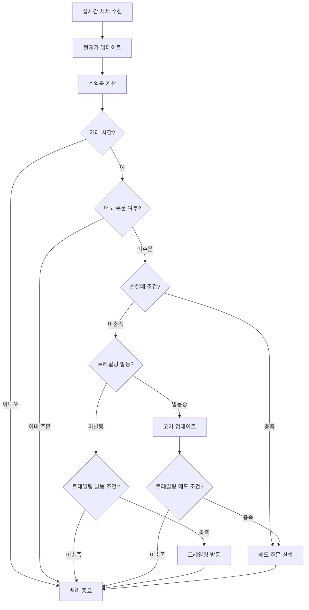
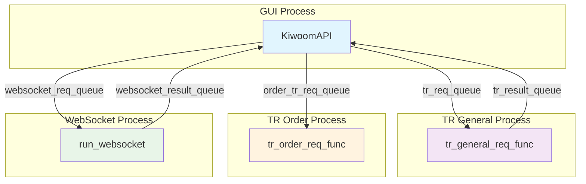
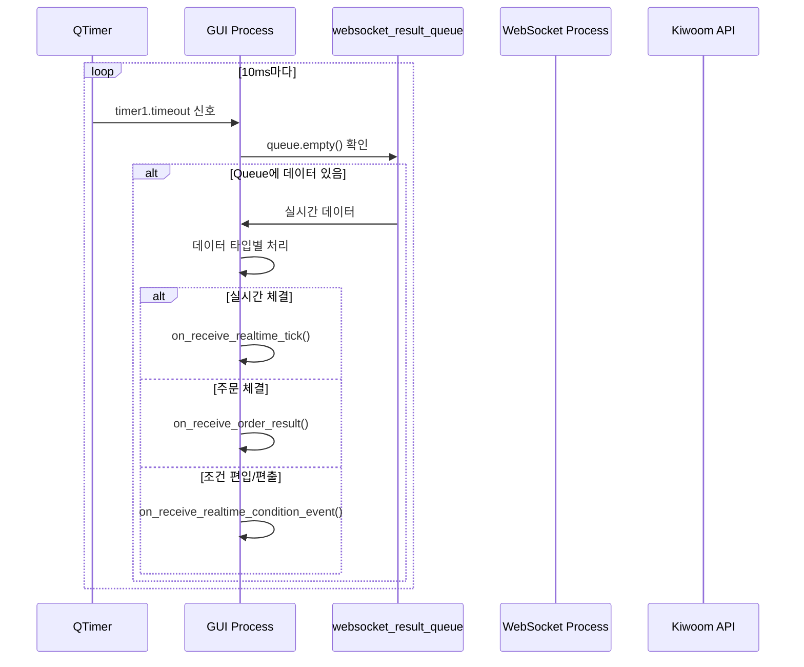

# 키움증권 자동매매 시스템 실행 방식 및 순서

## 1. 시스템 실행 환경 설정

### 1.1 필수 요구사항
- **Python 3.7 이상**
- **키움증권 계좌** (모의투자 또는 실계좌)
- **키움증권 Open API 신청** (API Key, Secret Key)
- **인터넷 연결** (실시간 데이터 수신용)

### 1.2 라이브러리 설치
```bash
pip install PyQt5
pip install requests
pip install websockets
pip install pandas
pip install loguru
```

### 1.3 설정 파일 구성
#### config.py 설정
```python
is_paper_trading = True  # 모의투자: True, 실투자: False
api_key = "발급받은_API_키"
api_secret_key = "발급받은_시크릿_키"
```

## 2. 시스템 시작 순서

### 2.1 프로그램 시작 흐름



### 2.2 상세 시작 단계

#### 단계 1: 메인 프로세스 초기화
```python
# 1. 환경 변수 설정
os.environ["QT_AUTO_SCREEN_SCALE_FACTOR"] = "1"

# 2. Queue 생성
tr_req_queue = Queue()
tr_result_queue = Queue()
order_tr_req_queue = Queue()
websocket_req_queue = Queue()
websocket_result_queue = Queue()

# 3. 서브 프로세스 생성 및 시작
tr_gen_process = Process(target=tr_general_req_func, args=(tr_req_queue, tr_result_queue), daemon=True)
tr_order_process = Process(target=tr_order_req_func, args=(order_tr_req_queue,), daemon=True)
tr_websocket_process = Process(target=run_websocket, args=(websocket_req_queue, websocket_result_queue), daemon=True)

# 4. 프로세스 시작
tr_gen_process.start()
tr_order_process.start()
tr_websocket_process.start()
```

#### 단계 2: GUI 애플리케이션 초기화
```python
# 5. PyQt5 애플리케이션 생성
app = QApplication(sys.argv)

# 6. 메인 창 생성
kiwoom_api = KiwoomAPI(
    tr_req_queue=tr_req_queue,
    tr_result_queue=tr_result_queue,
    order_tr_req_queue=order_tr_req_queue,
    websocket_req_queue=websocket_req_queue,
    websocket_result_queue=websocket_result_queue,
)

# 7. 애플리케이션 실행
sys.exit(app.exec_())
```

## 3. 초기화 프로세스 상세

### 3.1 GUI 초기화 순서



### 3.2 데이터 초기화

#### DataFrame 초기화
```python
# 조건검색 정보
self.condition_df = pd.DataFrame(columns=["조건index", "조건명"])

# 계좌 정보
self.account_info_df = pd.DataFrame(columns=["종목명", "현재가", "매입가", "보유수량", "매매가능수량", "수익률(%)"])

# 실시간 추적 정보 (pickle 파일에서 복원 시도)
try:
    self.realtime_tracking_df = pd.read_pickle("realtime_tracking_df.pkl")
except FileNotFoundError:
    self.realtime_tracking_df = pd.DataFrame(columns=[...])

# 주문 정보
self.order_info_df = pd.DataFrame(columns=["주문접수시간", "종목코드", "주문수량", "매수매도구분"])
```

### 3.3 타이머 설정



## 4. 자동매매 실행 흐름

### 4.1 자동매매 시작 과정



#### 자동매매 ON 실행 코드
```python
def auto_trade_on(self):
    # 1. 버튼 상태 변경
    self.autoOnPushButton.setEnabled(False)
    self.autoOffPushButton.setEnabled(True)
    
    # 2. 매수 조건식 실시간 등록
    self.websocket_req_queue.put(
        dict(
            action_id="조건검색실시간등록",
            조건index=self.condition_name_to_index_dict[self.buyConditionComboBox.currentText()],
        )
    )
    
    # 3. 매도 조건식 실시간 등록
    self.websocket_req_queue.put(
        dict(
            action_id="조건검색실시간등록",
            조건index=self.condition_name_to_index_dict[self.sellConditionComboBox.currentText()],
        )
    )
    
    # 4. 거래 상태 활성화
    self.is_no_transaction = False
    self.init_time()
    
    # 5. 거래시간 확인 타이머 시작
    self.timer6.start(1000)
```

### 4.2 실시간 매수 프로세스



### 4.3 실시간 매도 프로세스



### 4.4 주문 처리 상세 로직

#### 매수 주문 프로세스
```python
def on_receive_realtime_condition_event(self, data):
    조건식idx = data['조건식idx']
    종목코드 = data['종목코드']
    편입편출 = data['편입편출']
    
    # 매수 조건 확인
    if all([
        self.current_realtime_count < self.max_realtime_count,  # 실시간 등록 한도
        self.condition_name_to_index_dict[self.buyConditionComboBox.currentText()] == 조건식idx,
        편입편출 == "I",  # 편입
        not self.is_no_transaction,  # 거래 시간
        len(self.realtime_tracking_df) < self.maxAutoTradeCountSpinBox.value(),  # 최대 종목 수
        종목코드 not in self.account_info_df.index,  # 중복 매수 방지
        종목코드 not in self.realtime_tracking_df.index,
    ]):
        # 매수 처리 시작
        self.register_realtime_info(종목코드)  # 실시간 등록
        self.tr_req_queue.put(dict(action_id="주식기본정보", 종목코드=종목코드))  # 기본정보 요청
        # 추적 리스트에 추가
        self.realtime_tracking_df.loc[종목코드] = {...}
```

#### 매도 주문 프로세스
```python
def sell_order(self, 종목코드):
    if 종목코드 not in self.account_info_df.index:
        return
    
    self.realtime_tracking_df.at[종목코드, "매도주문여부"] = True
    
    시장가여부 = self.marketSellRadioButton.isChecked()
    주문수량 = self.account_info_df.at[종목코드, "매매가능수량"]
    현재가 = self.account_info_df.at[종목코드, "현재가"]
    
    주문가격 = ''
    if not 시장가여부:
        틱단위 = self.get_tick_size(현재가)
        주문가격 = self.get_order_price(현재가 + self.limitSellSpinBox.value() * 틱단위)
    
    self.order_tr_req_queue.put(
        dict(
            action_id="매도주문",
            종목코드=종목코드,
            주문수량=주문수량,
            주문가격=주문가격,
            시장가여부=시장가여부,
        )
    )
```

## 5. 프로세스 간 데이터 흐름

### 5.1 Queue 기반 통신



### 5.2 실시간 데이터 처리 흐름



## 6. 예외 처리 및 복구 메커니즘

### 6.1 시스템 안정성 보장

```mermaid
flowchart TD
    A[함수 실행] --> B[@log_exceptions 데코레이터]
    B --> C{예외 발생?}
    C -->|아니오| D[정상 실행]
    C -->|예| E[예외 로깅]
    E --> F[시스템 지속 운영]
    D --> G[결과 반환]
    F --> G
```

### 6.2 데이터 무결성 보장

#### 주기적 데이터 저장
```python
def save_pickle(self):
    try:
        # 변경사항이 있는 경우만 저장
        are_equal = self.realtime_tracking_df.equals(self.last_saved_realtime_tracking_df)
        if not are_equal:
            self.realtime_tracking_df.to_pickle("realtime_tracking_df.pkl")
            self.last_saved_realtime_tracking_df = self.realtime_tracking_df.copy(deep=True)
            logger.info("Saved df!")
    except Exception as e:
        logger.exception(e)
```

## 7. 시스템 종료 과정

### 7.1 정상 종료
1. **자동매매 OFF**: 사용자가 수동으로 자동매매 중단
2. **데이터 저장**: 현재 상태 pickle 파일에 저장
3. **실시간 해제**: 등록된 실시간 정보 모두 해제
4. **프로세스 종료**: daemon 프로세스들 자동 종료

### 7.2 비정상 종료 처리
```python
sys._excepthook = sys.excepthook

def my_exception_hook(exctype, value, traceback):
    logger.debug(f"exctype: {exctype}, value: {value}, traceback: {traceback}")
    sys._excepthook(exctype, value, traceback)
    sys.exit(1)

sys.excepthook = my_exception_hook
```

이 실행 구조는 안정적이고 효율적인 실시간 자동매매를 위해 멀티프로세싱과 비동기 처리를 최적화하여 설계되었습니다.