# 키움증권 자동매매 시스템 개선점 분석

## 1. 현재 시스템 분석

### 1.1 현재 시스템의 강점

#### 1.1.1 아키텍처 강점
- **멀티프로세싱 구조**: 안정적인 프로세스 분리로 한 영역의 오류가 전체 시스템에 미치는 영향 최소화
- **Queue 기반 통신**: 프로세스 간 안전한 데이터 전달 보장
- **실시간 처리**: WebSocket을 통한 효율적인 실시간 데이터 처리
- **모듈화 설계**: 기능별 모듈 분리로 유지보수성 향상

#### 1.1.2 기능적 강점
- **조건식 기반 자동매매**: 키움증권의 조건검색 기능 활용한 유연한 매매 전략
- **리스크 관리**: 손절매, 트레일링 스탑 등 체계적인 위험 관리
- **실시간 모니터링**: 직관적인 GUI를 통한 실시간 포트폴리오 추적
- **설정 저장**: QSettings를 통한 사용자 설정 영구 저장

### 1.2 현재 시스템의 약점 및 한계

#### 1.2.1 아키텍처 한계
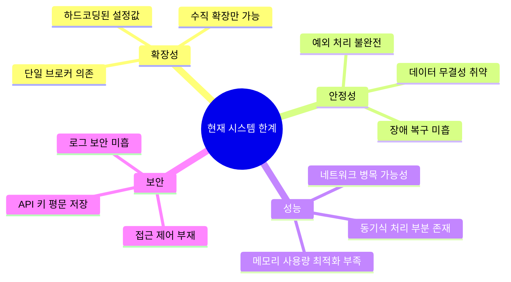

#### 1.2.2 코드 품질 이슈
- **코드 복잡도**: 단일 클래스에 과도한 책임 집중 (KiwoomAPI 클래스)
- **하드코딩**: 설정값들이 코드에 직접 입력
- **에러 처리**: 일관성 없는 예외 처리 방식
- **테스트 부재**: 단위 테스트 및 통합 테스트 코드 없음

## 2. 아키텍처 개선 방안

### 2.1 마이크로서비스 아키텍처 전환

#### 2.1.1 현재 vs 개선된 아키텍처
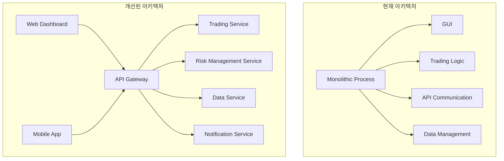

#### 2.1.2 서비스 분리 계획
| 서비스명 | 책임 | 독립성 | 확장성 |
|----------|------|--------|--------|
| Trading Service | 매수/매도 로직 처리 | 높음 | 수평 확장 |
| Risk Management | 손절매, 포지션 관리 | 높음 | 수평 확장 |
| Data Service | 시세 데이터 관리 | 중간 | 수평 확장 |
| Notification | 알림 발송 | 높음 | 수평 확장 |
| User Management | 사용자 인증/권한 | 높음 | 수평 확장 |

### 2.2 데이터베이스 개선

#### 2.2.1 현재 데이터 저장 방식의 문제점
- **Pickle 파일**: 데이터 무결성 보장 어려움, 동시성 이슈
- **QSettings**: 복잡한 데이터 구조 저장 제한
- **메모리 의존**: 시스템 재시작 시 데이터 손실 위험

#### 2.2.2 개선된 데이터 아키텍처
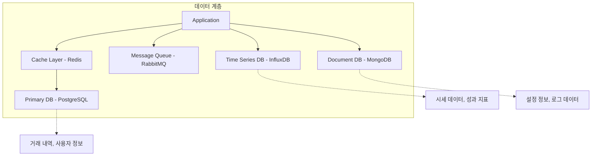

#### 2.2.3 데이터베이스 선택 기준
| 데이터 유형 | 선택된 DB | 이유 |
|-------------|-----------|------|
| 거래 내역 | PostgreSQL | ACID 보장, 복잡한 쿼리 지원 |
| 시세 데이터 | InfluxDB | 시계열 데이터 최적화 |
| 사용자 설정 | MongoDB | 스키마 유연성 |
| 세션 데이터 | Redis | 고성능 캐싱 |

### 2.3 클라우드 네이티브 전환

#### 2.3.1 컨테이너화 전략
```dockerfile
# 예시: Trading Service Dockerfile
FROM python:3.11-slim

WORKDIR /app
COPY requirements.txt .
RUN pip install -r requirements.txt

COPY . .
EXPOSE 8080

CMD ["uvicorn", "main:app", "--host", "0.0.0.0", "--port", "8080"]
```

#### 2.3.2 Kubernetes 배포 구조
```yaml
# 예시: Trading Service 배포 설정
apiVersion: apps/v1
kind: Deployment
metadata:
  name: trading-service
spec:
  replicas: 3
  selector:
    matchLabels:
      app: trading-service
  template:
    metadata:
      labels:
        app: trading-service
    spec:
      containers:
      - name: trading-service
        image: trading-service:v1.0.0
        ports:
        - containerPort: 8080
        env:
        - name: DATABASE_URL
          valueFrom:
            secretKeyRef:
              name: db-secret
              key: url
```

## 3. 기능적 개선 방안

### 3.1 고급 매매 전략 구현

#### 3.1.1 AI/ML 기반 의사결정
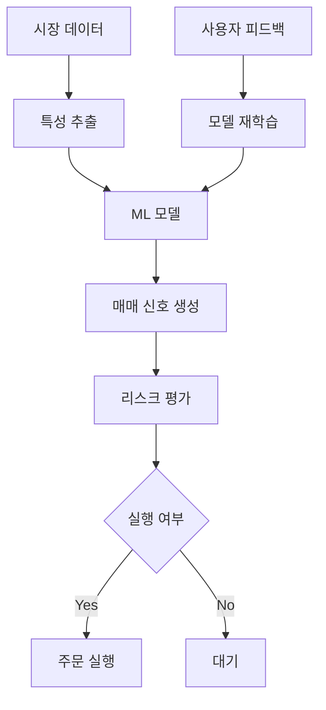

#### 3.1.2 고급 전략 모듈
| 전략 유형 | 알고리즘 | 적용 시장 | 예상 성과 |
|-----------|----------|-----------|----------|
| 모멘텀 전략 | LSTM + RSI | 개별 종목 | 연 +15% |
| 평균 회귀 | Bollinger Band + SVM | 지수 ETF | 연 +8% |
| 페어 트레이딩 | 공적분 + KF | 관련 종목 | 연 +12% |
| 볼륨 분석 | VWAP + Random Forest | 대형주 | 연 +10% |

### 3.2 포트폴리오 관리 고도화

#### 3.2.1 현재 vs 개선된 포트폴리오 관리
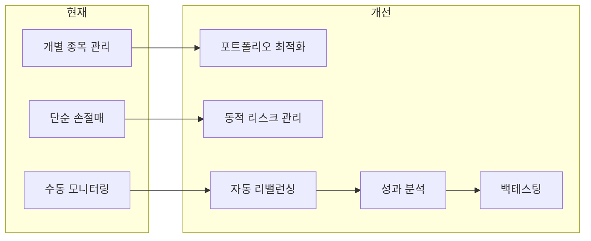

#### 3.2.2 리스크 관리 고도화
```python
# 개선된 리스크 관리 예시
class AdvancedRiskManager:
    def __init__(self):
        self.var_calculator = VaRCalculator()
        self.correlation_analyzer = CorrelationAnalyzer()
        self.portfolio_optimizer = PortfolioOptimizer()
    
    def calculate_portfolio_risk(self, portfolio):
        """포트폴리오 전체 리스크 계산"""
        var_95 = self.var_calculator.calculate_var(portfolio, confidence=0.95)
        correlation_risk = self.correlation_analyzer.analyze(portfolio)
        concentration_risk = self.calculate_concentration_risk(portfolio)
        
        return {
            'var_95': var_95,
            'correlation_risk': correlation_risk,
            'concentration_risk': concentration_risk,
            'total_risk_score': self.combine_risks(var_95, correlation_risk, concentration_risk)
        }
    
    def suggest_rebalancing(self, portfolio, target_risk):
        """리밸런싱 제안"""
        current_risk = self.calculate_portfolio_risk(portfolio)
        if current_risk['total_risk_score'] > target_risk:
            return self.portfolio_optimizer.optimize(portfolio, target_risk)
        return None
```

### 3.3 사용자 경험 개선

#### 3.3.1 대시보드 고도화
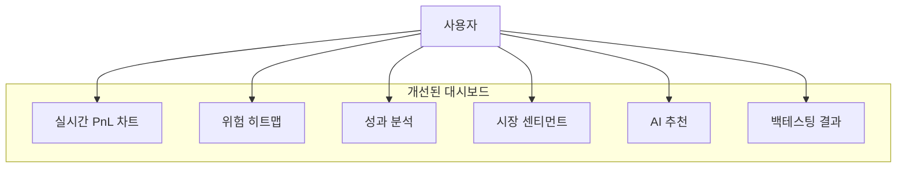

#### 3.3.2 모바일 앱 개발
- **React Native**: 크로스 플랫폼 모바일 앱
- **실시간 알림**: Push 알림 시스템
- **간편 모니터링**: 핵심 지표 중심 UI
- **긴급 제어**: 원터치 전체 매도 기능

## 4. 성능 최적화 방안

### 4.1 실시간 처리 성능 개선

#### 4.1.1 현재 처리 흐름의 병목점
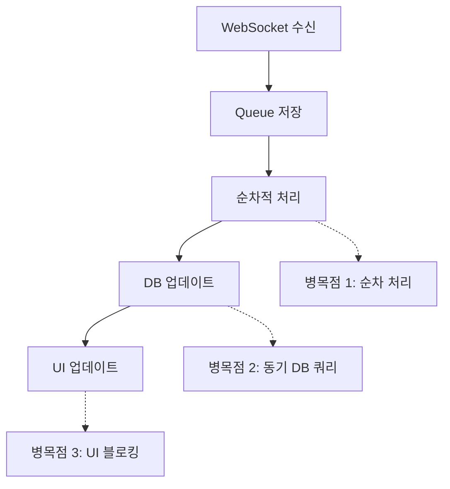

#### 4.1.2 개선된 비동기 처리 아키텍처
```python
# 개선된 비동기 처리 예시
import asyncio
import aioredis
from concurrent.futures import ThreadPoolExecutor

class AsyncTradingEngine:
    def __init__(self):
        self.redis = aioredis.Redis()
        self.executor = ThreadPoolExecutor(max_workers=10)
        self.event_loop = asyncio.get_event_loop()
    
    async def process_market_data(self, data):
        """비동기 시세 데이터 처리"""
        tasks = [
            self.update_cache(data),
            self.calculate_signals(data),
            self.update_ui(data),
            self.check_risk_limits(data)
        ]
        await asyncio.gather(*tasks)
    
    async def update_cache(self, data):
        """캐시 업데이트 (비동기)"""
        await self.redis.hset(f"stock:{data['code']}", mapping=data)
    
    async def calculate_signals(self, data):
        """매매 신호 계산 (CPU 집약적 작업은 별도 스레드)"""
        loop = asyncio.get_event_loop()
        signals = await loop.run_in_executor(
            self.executor, 
            self._calculate_signals_sync, 
            data
        )
        return signals
```

### 4.2 메모리 최적화

#### 4.2.1 메모리 사용량 분석
| 컴포넌트 | 현재 사용량 | 최적화 후 | 개선 방법 |
|----------|-------------|-----------|-----------|
| DataFrame | 200MB | 50MB | 데이터 타입 최적화, 압축 |
| 실시간 캐시 | 100MB | 30MB | LRU 캐시, TTL 설정 |
| UI 버퍼 | 50MB | 20MB | 가상화, 지연 로딩 |
| 로그 데이터 | 80MB | 10MB | 압축, 로테이션 |

#### 4.2.2 메모리 효율적인 데이터 구조
```python
# 메모리 최적화 예시
import numpy as np
from dataclasses import dataclass
from typing import Optional

@dataclass
class OptimizedStockData:
    """메모리 효율적인 주식 데이터 구조"""
    code: str
    price: np.float32  # float64 대신 float32 사용
    volume: np.uint32  # int64 대신 uint32 사용
    timestamp: np.uint64
    
    def __post_init__(self):
        # 메모리 풀 사용으로 객체 재사용
        self._memory_pool = ObjectPool(self.__class__)

class CircularBuffer:
    """순환 버퍼로 메모리 사용량 제한"""
    def __init__(self, max_size=1000):
        self.buffer = np.zeros(max_size, dtype=OptimizedStockData)
        self.max_size = max_size
        self.current = 0
    
    def add(self, item):
        self.buffer[self.current] = item
        self.current = (self.current + 1) % self.max_size
```

### 4.3 네트워크 최적화

#### 4.3.1 연결 풀링 및 재사용
```python
# 개선된 네트워크 관리
import aiohttp
from aiohttp_retry import RetryClient, ExponentialRetry

class OptimizedAPIClient:
    def __init__(self):
        self.connector = aiohttp.TCPConnector(
            limit=100,  # 최대 연결 수
            limit_per_host=20,  # 호스트당 최대 연결 수
            keepalive_timeout=300,  # Keep-alive 타임아웃
            enable_cleanup_closed=True
        )
        
        retry_options = ExponentialRetry(attempts=3)
        self.session = RetryClient(
            connector=self.connector,
            retry_options=retry_options,
            timeout=aiohttp.ClientTimeout(total=30)
        )
    
    async def make_request(self, url, data=None):
        """재시도 로직이 포함된 API 요청"""
        async with self.session.post(url, json=data) as response:
            return await response.json()
```

## 5. 보안 강화 방안

### 5.1 인증 및 권한 관리

#### 5.1.1 현재 vs 개선된 보안 구조
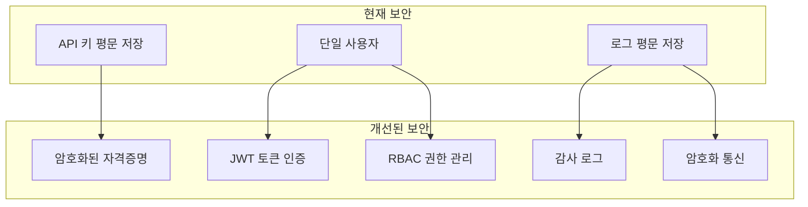

#### 5.1.2 보안 구현 예시
```python
# 보안 강화 예시
import jwt
from cryptography.fernet import Fernet
import hashlib
import secrets

class SecurityManager:
    def __init__(self):
        self.key = self._load_or_generate_key()
        self.cipher = Fernet(self.key)
        self.jwt_secret = secrets.token_urlsafe(32)
    
    def encrypt_credentials(self, credentials):
        """자격증명 암호화"""
        data = json.dumps(credentials).encode()
        encrypted = self.cipher.encrypt(data)
        return encrypted
    
    def decrypt_credentials(self, encrypted_data):
        """자격증명 복호화"""
        decrypted = self.cipher.decrypt(encrypted_data)
        return json.loads(decrypted.decode())
    
    def generate_token(self, user_id, permissions):
        """JWT 토큰 생성"""
        payload = {
            'user_id': user_id,
            'permissions': permissions,
            'exp': datetime.utcnow() + timedelta(hours=24),
            'iat': datetime.utcnow()
        }
        return jwt.encode(payload, self.jwt_secret, algorithm='HS256')
    
    def validate_token(self, token):
        """JWT 토큰 검증"""
        try:
            payload = jwt.decode(token, self.jwt_secret, algorithms=['HS256'])
            return payload
        except jwt.ExpiredSignatureError:
            raise SecurityError("Token expired")
        except jwt.InvalidTokenError:
            raise SecurityError("Invalid token")
```

### 5.2 데이터 보호

#### 5.2.1 민감 데이터 처리
```python
# 민감 정보 마스킹
class DataMasker:
    @staticmethod
    def mask_account_number(account):
        """계좌번호 마스킹"""
        return f"{account[:3]}****{account[-3:]}"
    
    @staticmethod
    def mask_api_key(api_key):
        """API 키 마스킹"""
        return f"{api_key[:8]}{'*' * 20}{api_key[-4:]}"
    
    @staticmethod
    def sanitize_log_data(log_data):
        """로그 데이터 민감 정보 제거"""
        sensitive_fields = ['password', 'api_key', 'account_number']
        for field in sensitive_fields:
            if field in log_data:
                log_data[field] = "[MASKED]"
        return log_data
```

## 6. 확장성 개선 방안

### 6.1 멀티 브로커 지원

#### 6.1.1 브로커 추상화 레이어
```python
# 브로커 추상화 예시
from abc import ABC, abstractmethod

class BrokerInterface(ABC):
    @abstractmethod
    async def authenticate(self, credentials):
        pass
    
    @abstractmethod
    async def get_account_info(self):
        pass
    
    @abstractmethod
    async def place_order(self, order):
        pass
    
    @abstractmethod
    async def get_market_data(self, symbols):
        pass

class KiwoomBroker(BrokerInterface):
    """키움증권 구현"""
    async def authenticate(self, credentials):
        # 키움증권 인증 로직
        pass

class IBBroker(BrokerInterface):
    """Interactive Brokers 구현"""
    async def authenticate(self, credentials):
        # IB 인증 로직
        pass

class BrokerFactory:
    @staticmethod
    def create_broker(broker_type):
        brokers = {
            'kiwoom': KiwoomBroker,
            'ib': IBBroker,
            # 추가 브로커들...
        }
        return brokers[broker_type]()
```

### 6.2 글로벌 시장 지원

#### 6.2.1 다중 시장 아키텍처
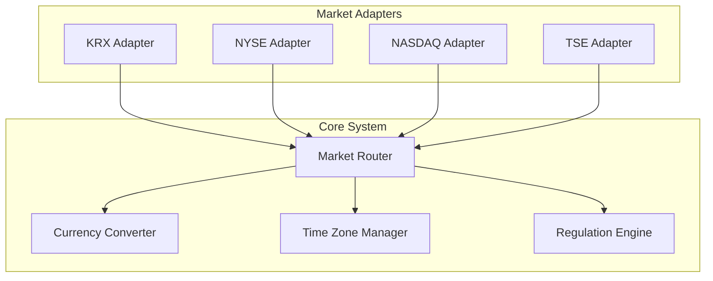

### 6.3 수평 확장 지원

#### 6.3.1 로드 밸런싱 및 클러스터링
```yaml
# Kubernetes 로드 밸런서 설정
apiVersion: v1
kind: Service
metadata:
  name: trading-service-lb
spec:
  selector:
    app: trading-service
  ports:
  - port: 80
    targetPort: 8080
  type: LoadBalancer
  
---
apiVersion: autoscaling/v2
kind: HorizontalPodAutoscaler
metadata:
  name: trading-service-hpa
spec:
  scaleTargetRef:
    apiVersion: apps/v1
    kind: Deployment
    name: trading-service
  minReplicas: 3
  maxReplicas: 10
  metrics:
  - type: Resource
    resource:
      name: cpu
      target:
        type: Utilization
        averageUtilization: 70
```

## 7. 모니터링 및 관찰성 개선

### 7.1 종합 모니터링 대시보드

#### 7.1.1 메트릭 수집 구조
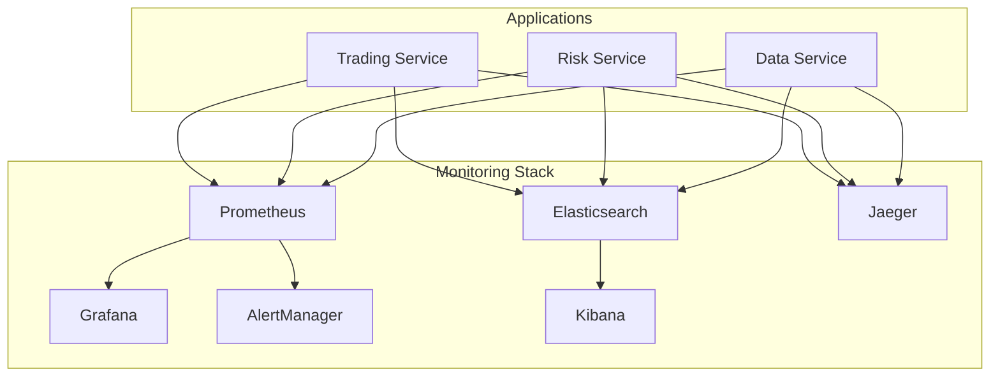

#### 7.1.2 핵심 모니터링 지표
| 분류 | 지표 | 임계값 | 알림 조건 |
|------|------|--------|-----------|
| 성능 | API 응답시간 | < 100ms | > 200ms |
| 성능 | 처리량 (TPS) | > 1000 | < 500 |
| 오류 | 에러율 | < 0.1% | > 1% |
| 비즈니스 | 일일 거래량 | > 100건 | < 50건 |
| 시스템 | CPU 사용률 | < 70% | > 90% |
| 시스템 | 메모리 사용률 | < 80% | > 95% |

### 7.2 분산 추적 시스템

#### 7.2.1 트레이싱 구현 예시
```python
# OpenTelemetry를 사용한 분산 추적
from opentelemetry import trace
from opentelemetry.exporter.jaeger.thrift import JaegerExporter
from opentelemetry.sdk.trace import TracerProvider
from opentelemetry.sdk.trace.export import BatchSpanProcessor

# 트레이서 설정
trace.set_tracer_provider(TracerProvider())
tracer = trace.get_tracer(__name__)

jaeger_exporter = JaegerExporter(
    agent_host_name="jaeger",
    agent_port=6831,
)

span_processor = BatchSpanProcessor(jaeger_exporter)
trace.get_tracer_provider().add_span_processor(span_processor)

class TracedTradingService:
    def __init__(self):
        self.tracer = trace.get_tracer(__name__)
    
    async def execute_trade(self, order):
        with self.tracer.start_as_current_span("execute_trade") as span:
            span.set_attribute("order.symbol", order.symbol)
            span.set_attribute("order.quantity", order.quantity)
            
            # 주문 검증
            with self.tracer.start_as_current_span("validate_order"):
                validation_result = await self.validate_order(order)
            
            # 리스크 확인
            with self.tracer.start_as_current_span("risk_check"):
                risk_result = await self.check_risk(order)
            
            # 주문 실행
            with self.tracer.start_as_current_span("place_order"):
                result = await self.place_order(order)
            
            span.set_attribute("trade.result", result.status)
            return result
```

## 8. 개발 프로세스 개선

### 8.1 CI/CD 파이프라인 구축

#### 8.1.1 GitOps 기반 배포 파이프라인


#### 8.1.2 GitHub Actions 워크플로우 예시
```yaml
# .github/workflows/ci-cd.yml
name: CI/CD Pipeline

on:
  push:
    branches: [main, develop]
  pull_request:
    branches: [main]

jobs:
  test:
    runs-on: ubuntu-latest
    steps:
    - uses: actions/checkout@v3
    
    - name: Set up Python
      uses: actions/setup-python@v4
      with:
        python-version: '3.11'
    
    - name: Install dependencies
      run: |
        pip install -r requirements.txt
        pip install pytest pytest-cov
    
    - name: Run tests
      run: |
        pytest --cov=src --cov-report=xml
    
    - name: Upload coverage
      uses: codecov/codecov-action@v3
  
  security:
    runs-on: ubuntu-latest
    steps:
    - uses: actions/checkout@v3
    
    - name: Security scan
      uses: securecodewarrior/github-action-add-sarif@v1
      with:
        sarif-file: security-scan.sarif
  
  build:
    needs: [test, security]
    runs-on: ubuntu-latest
    steps:
    - uses: actions/checkout@v3
    
    - name: Build Docker image
      run: |
        docker build -t trading-system:${{ github.sha }} .
        docker tag trading-system:${{ github.sha }} trading-system:latest
    
    - name: Push to registry
      run: |
        docker push trading-system:${{ github.sha }}
        docker push trading-system:latest
```

### 8.2 테스트 자동화 강화

#### 8.2.1 테스트 피라미드 구현
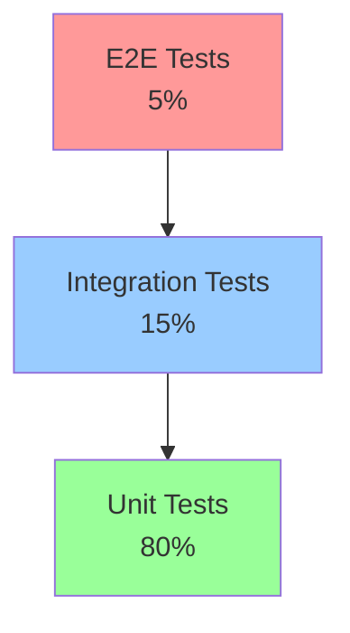

#### 8.2.2 테스트 코드 예시
```python
# tests/unit/test_trading_engine.py
import pytest
from unittest.mock import Mock, patch
from src.trading.engine import TradingEngine

class TestTradingEngine:
    @pytest.fixture
    def trading_engine(self):
        return TradingEngine()
    
    @pytest.fixture
    def mock_broker(self):
        return Mock()
    
    @pytest.mark.asyncio
    async def test_buy_order_execution(self, trading_engine, mock_broker):
        # Given
        order = {
            'symbol': 'AAPL',
            'quantity': 100,
            'price': 150.0,
            'side': 'buy'
        }
        mock_broker.place_order.return_value = {'status': 'filled', 'order_id': '12345'}
        
        # When
        result = await trading_engine.execute_order(order, mock_broker)
        
        # Then
        assert result['status'] == 'filled'
        mock_broker.place_order.assert_called_once_with(order)
    
    def test_risk_validation(self, trading_engine):
        # Given
        portfolio = {'cash': 10000, 'positions': {}}
        order = {'symbol': 'AAPL', 'quantity': 1000, 'price': 150.0}
        
        # When
        is_valid = trading_engine.validate_risk(portfolio, order)
        
        # Then
        assert not is_valid  # 자금 부족으로 주문 거부

# tests/integration/test_api_integration.py
import pytest
import asyncio
from src.api.client import APIClient

class TestAPIIntegration:
    @pytest.mark.integration
    @pytest.mark.asyncio
    async def test_real_api_connection(self):
        # 실제 API 연결 테스트 (테스트 환경)
        client = APIClient(test_mode=True)
        
        # When
        account_info = await client.get_account_info()
        
        # Then
        assert 'balance' in account_info
        assert 'positions' in account_info
```

## 9. 사용자 경험 (UX) 개선

### 9.1 현대적 웹 인터페이스

#### 9.1.1 React 기반 웹 대시보드
```jsx
// 개선된 웹 대시보드 예시
import React, { useState, useEffect } from 'react';
import { LineChart, Line, XAxis, YAxis, CartesianGrid, Tooltip } from 'recharts';
import { Card, CardHeader, CardContent } from '@/components/ui/card';

const TradingDashboard = () => {
  const [portfolioData, setPortfolioData] = useState([]);
  const [realTimeData, setRealTimeData] = useState({});
  
  useEffect(() => {
    // WebSocket 연결로 실시간 데이터 수신
    const ws = new WebSocket('ws://localhost:8080/realtime');
    
    ws.onmessage = (event) => {
      const data = JSON.parse(event.data);
      setRealTimeData(data);
    };
    
    return () => ws.close();
  }, []);
  
  return (
    <div className="grid grid-cols-1 lg:grid-cols-3 gap-6 p-6">
      {/* 포트폴리오 요약 */}
      <Card className="lg:col-span-2">
        <CardHeader>
          <h2 className="text-2xl font-bold">포트폴리오 성과</h2>
        </CardHeader>
        <CardContent>
          <LineChart width={600} height={300} data={portfolioData}>
            <CartesianGrid strokeDasharray="3 3" />
            <XAxis dataKey="time" />
            <YAxis />
            <Tooltip />
            <Line type="monotone" dataKey="value" stroke="#8884d8" />
          </LineChart>
        </CardContent>
      </Card>
      
      {/* 실시간 지표 */}
      <Card>
        <CardHeader>
          <h3 className="text-lg font-semibold">실시간 지표</h3>
        </CardHeader>
        <CardContent>
          <div className="space-y-4">
            <MetricCard 
              title="총 자산" 
              value={realTimeData.totalAssets} 
              change={realTimeData.dailyChange}
            />
            <MetricCard 
              title="수익률" 
              value={`${realTimeData.returnRate}%`} 
              change={realTimeData.returnChange}
            />
            <MetricCard 
              title="활성 포지션" 
              value={realTimeData.activePositions} 
            />
          </div>
        </CardContent>
      </Card>
    </div>
  );
};
```

### 9.2 모바일 앱 개발

#### 9.2.1 React Native 모바일 앱
```jsx
// 모바일 앱 주요 화면
import React from 'react';
import { View, Text, ScrollView, TouchableOpacity } from 'react-native';
import { useNavigation } from '@react-navigation/native';

const PortfolioScreen = () => {
  const navigation = useNavigation();
  
  return (
    <ScrollView style={styles.container}>
      {/* 포트폴리오 헤더 */}
      <View style={styles.header}>
        <Text style={styles.totalValue}>₩12,345,678</Text>
        <Text style={styles.dailyChange}>+₩123,456 (+1.25%)</Text>
      </View>
      
      {/* 퀵 액션 버튼 */}
      <View style={styles.quickActions}>
        <TouchableOpacity 
          style={styles.actionButton}
          onPress={() => navigation.navigate('Trading')}
        >
          <Text>수동 거래</Text>
        </TouchableOpacity>
        
        <TouchableOpacity 
          style={[styles.actionButton, styles.emergencyButton]}
          onPress={handleEmergencyStop}
        >
          <Text style={styles.emergencyText}>긴급 정지</Text>
        </TouchableOpacity>
      </View>
      
      {/* 포지션 리스트 */}
      <PositionList positions={positions} />
    </ScrollView>
  );
};
```

## 10. 비용 효율성 개선

### 10.1 클라우드 비용 최적화

#### 10.1.1 리소스 사용량 기반 스케일링
```python
# 비용 최적화를 위한 스마트 스케일링
class CostOptimizedScaler:
    def __init__(self):
        self.market_hours = self._get_market_hours()
        self.historical_usage = self._load_historical_usage()
    
    def calculate_optimal_capacity(self, current_time):
        """시간대별 최적 용량 계산"""
        if self._is_market_open(current_time):
            # 장중: 높은 용량 필요
            base_capacity = 10
            predicted_load = self._predict_load(current_time)
            return max(base_capacity, predicted_load * 1.2)
        else:
            # 장외: 최소 용량으로 운영
            return 2
    
    def _predict_load(self, current_time):
        """과거 데이터 기반 부하 예측"""
        similar_periods = self._find_similar_periods(current_time)
        return np.mean([period.load for period in similar_periods])
```

### 10.2 API 호출 최적화

#### 10.2.1 배치 처리 및 캐싱 전략
```python
# API 호출 최적화
class OptimizedAPIClient:
    def __init__(self):
        self.cache = TTLCache(maxsize=1000, ttl=300)  # 5분 캐시
        self.batch_requests = []
        self.batch_timer = None
    
    async def get_stock_price(self, symbol):
        """캐시된 주가 조회"""
        if symbol in self.cache:
            return self.cache[symbol]
        
        # 배치 요청에 추가
        self.batch_requests.append(symbol)
        
        if len(self.batch_requests) >= 10:  # 배치 크기 도달
            await self._process_batch()
        elif not self.batch_timer:  # 타이머 시작
            self.batch_timer = asyncio.create_task(
                self._delayed_batch_process()
            )
    
    async def _process_batch(self):
        """배치 요청 처리"""
        symbols = self.batch_requests.copy()
        self.batch_requests.clear()
        
        # 한 번의 API 호출로 여러 종목 조회
        prices = await self.api.get_multiple_prices(symbols)
        
        # 캐시에 저장
        for symbol, price in prices.items():
            self.cache[symbol] = price
```

이러한 개선 방안들을 단계적으로 적용하면 현재 시스템을 세계적 수준의 자동매매 플랫폼으로 발전시킬 수 있습니다. 각 개선사항은 독립적으로 구현 가능하므로, 우선순위에 따라 순차적으로 적용하는 것이 효과적입니다.