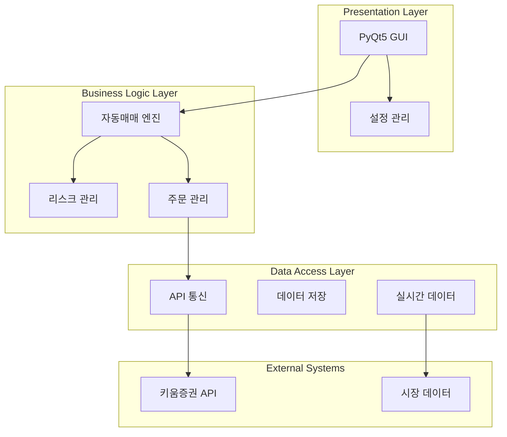
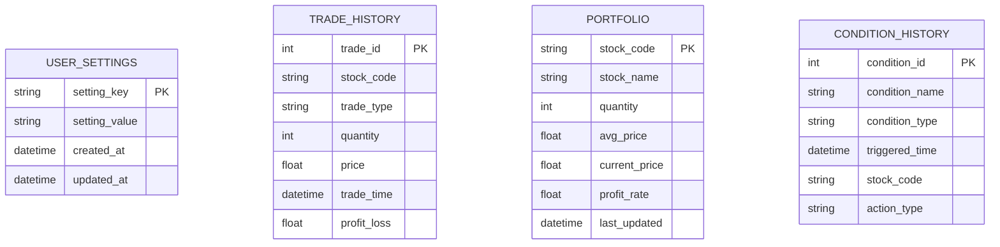
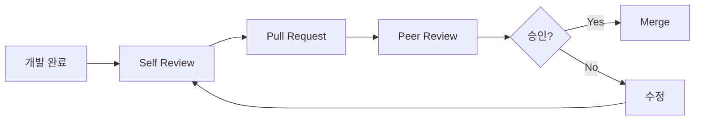
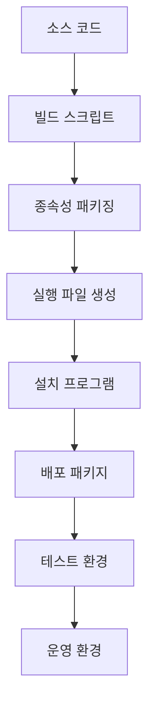
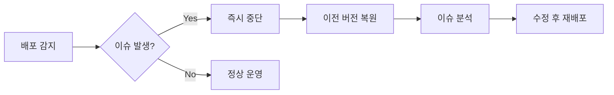
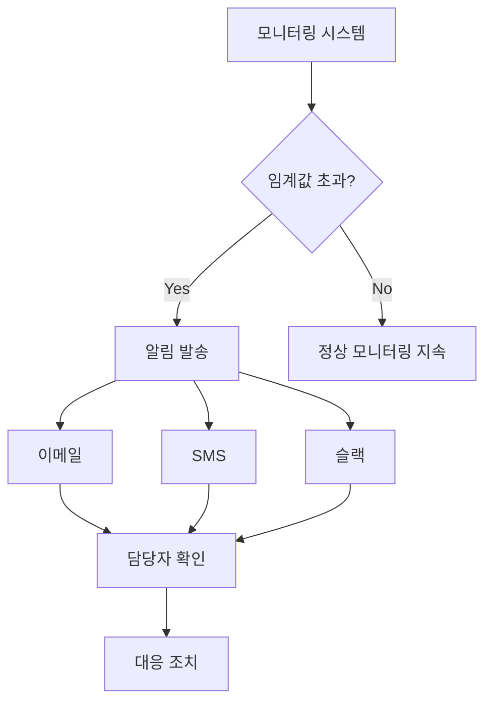
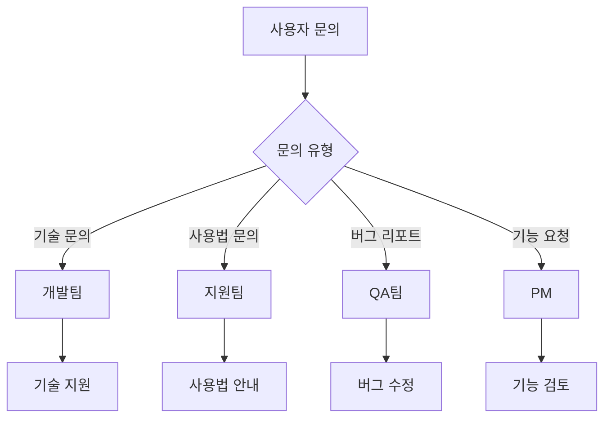
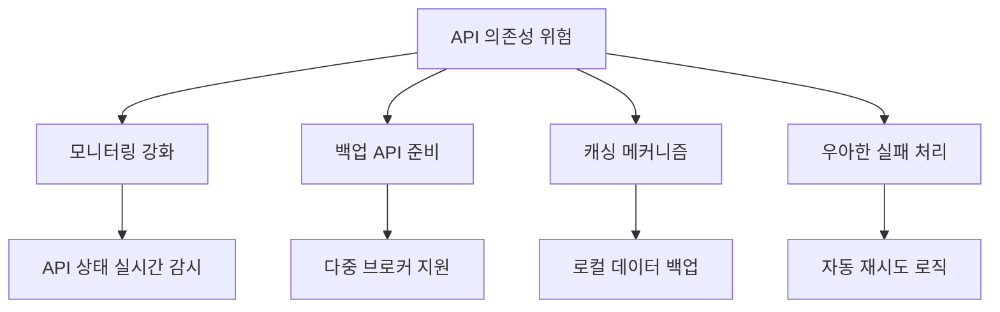

# 키움증권 자동매매 시스템 프로젝트 계획서

## 1. 프로젝트 개요

### 1.1 프로젝트 정보
- **프로젝트명**: 키움증권 API 기반 자동매매 시스템 (AutoTrader)
- **프로젝트 유형**: 개인/소규모 투자자용 데스크톱 애플리케이션

### 1.2 프로젝트 목표
- **주목표**: 안정적이고 효율적인 주식 자동매매 시스템 구축
- **부목표**: 
  - 실시간 포트폴리오 관리 기능 제공
  - 리스크 관리 기능 강화
  - 사용자 친화적 인터페이스 구현
  - 백테스팅 및 성과 분석 기능 추가

## 2. 요구사항 분석

### 2.1 기능적 요구사항

#### 2.1.1 핵심 기능
| 기능 분류 | 상세 기능 | 우선순위 | 복잡도 |
|-----------|-----------|----------|--------|
| 자동매매 | 조건식 기반 매수/매도 | 높음 | 중 |
| 주문 관리 | 시장가/지정가 주문 | 높음 | 낮음 |
| 리스크 관리 | 손절매, 트레일링 스탑 | 높음 | 중 |
| 실시간 모니터링 | 계좌 현황, 시세 조회 | 높음 | 중 |
| 미체결 관리 | 자동 정정 주문 | 중간 | 낮음 |

#### 2.1.2 추가 기능 (향후 개발)
| 기능 분류 | 상세 기능 | 우선순위 | 복잡도 |
|-----------|-----------|----------|--------|
| 백테스팅 | 과거 데이터 기반 전략 검증 | 중간 | 높음 |
| 성과 분석 | 수익률, 샤프 비율 등 분석 | 중간 | 중 |
| 알림 시스템 | 이메일, SMS 알림 | 낮음 | 낮음 |
| 데이터베이스 | 거래 내역 DB 저장 | 낮음 | 중 |

### 2.2 비기능적 요구사항

#### 2.2.1 성능 요구사항
- **응답 시간**: 실시간 데이터 처리 100ms 이하
- **처리량**: 동시 100종목 실시간 처리 가능
- **메모리 사용량**: 최대 500MB 이하
- **CPU 사용률**: 평균 10% 이하

#### 2.2.2 신뢰성 요구사항
- **가용성**: 99.9% (거래 시간 기준)
- **복구 시간**: 시스템 오류 시 5분 이내 복구
- **데이터 무결성**: 거래 데이터 100% 정확성 보장

#### 2.2.3 보안 요구사항
- **API 키 보안**: 암호화된 설정 파일 저장
- **접근 제어**: 사용자 인증 및 권한 관리
- **로그 보안**: 민감 정보 마스킹

## 3. 시스템 설계

### 3.1 아키텍처 설계

#### 3.1.1 전체 시스템 구조


#### 3.1.2 모듈 구조
```
src/
├── main/
│   ├── example8-1.py          # 메인 GUI 애플리케이션
│   └── main.ui                # UI 디자인 파일
├── core/
│   ├── tr_process_functions.py # TR 처리 함수
│   ├── websocket_functions.py  # WebSocket 처리
│   └── utils.py               # 유틸리티 함수
├── config/
│   └── config.py              # 설정 관리
├── data/
│   └── realtime_tracking_df.pkl # 실시간 데이터
└── tests/
    ├── unit_tests/            # 단위 테스트
    └── integration_tests/     # 통합 테스트
```

### 3.2 데이터베이스 설계

#### 3.2.1 데이터 모델


## 4. 개발 계획

### 4.1 개발 단계별 계획

#### Phase 1: 기반 구조 개발 (2주)
**목표**: 기본 시스템 구조 및 API 연동 구현

| 주차 | 작업 내용 | 산출물 | 담당자 |
|------|-----------|--------|--------|
| 1주차 | - 프로젝트 환경 설정<br/>- API 연동 기본 구조<br/>- 설정 파일 구조 | - 개발환경<br/>- API 기본 클래스<br/>- config.py | 개발자 |
| 2주차 | - GUI 기본 구조<br/>- 멀티프로세싱 구조<br/>- 로깅 시스템 | - PyQt5 기본 UI<br/>- 프로세스 관리<br/>- 로그 시스템 | 개발자 |

#### Phase 2: 핵심 기능 개발 (3주)
**목표**: 자동매매 핵심 기능 구현

| 주차 | 작업 내용 | 산출물 | 담당자 |
|------|-----------|--------|--------|
| 3주차 | - TR 요청/응답 처리<br/>- 실시간 데이터 수신<br/>- 계좌 정보 조회 | - TR 처리 모듈<br/>- WebSocket 클라이언트<br/>- 계좌 관리 | 개발자 |
| 4주차 | - 조건식 기반 매수 로직<br/>- 주문 실행 시스템<br/>- 실시간 시세 처리 | - 매수 엔진<br/>- 주문 관리 시스템<br/>- 시세 처리 | 개발자 |
| 5주차 | - 매도 로직 (조건식, 손절매)<br/>- 트레일링 스탑<br/>- 미체결 관리 | - 매도 엔진<br/>- 리스크 관리<br/>- 주문 관리 | 개발자 |

#### Phase 3: 고급 기능 및 최적화 (2주)
**목표**: 사용자 편의성 및 안정성 강화

| 주차 | 작업 내용 | 산출물 | 담당자 |
|------|-----------|--------|--------|
| 6주차 | - UI/UX 개선<br/>- 설정 저장/로드<br/>- 예외 처리 강화 | - 완성된 GUI<br/>- 설정 관리<br/>- 오류 처리 | 개발자 |
| 7주차 | - 성능 최적화<br/>- 메모리 관리<br/>- 코드 리팩토링 | - 최적화된 코드<br/>- 성능 개선 | 개발자 |

#### Phase 4: 테스트 및 배포 (2주)
**목표**: 시스템 검증 및 배포 준비

| 주차 | 작업 내용 | 산출물 | 담당자 |
|------|-----------|--------|--------|
| 8주차 | - 단위 테스트<br/>- 통합 테스트<br/>- 모의투자 테스트 | - 테스트 코드<br/>- 테스트 결과<br/>- 버그 리포트 | 테스터 |
| 9주차 | - 실투자 환경 테스트<br/>- 문서화<br/>- 배포 패키징 | - 사용자 매뉴얼<br/>- 기술 문서<br/>- 배포 파일 | 테스터 |

### 4.2 개발 리소스 계획

#### 4.2.1 인적 리소스
| 역할 | 이름 | 투입 기간 | 주요 업무 |
|------|------|-----------|----------|
| 프로젝트 매니저 | PM | 9주 | 전체 일정 관리, 품질 관리 |
| 시니어 개발자 | Dev1 | 7주 | 핵심 로직 개발, 아키텍처 설계 |
| 주니어 개발자 | Dev2 | 4주 | UI 개발, 유틸리티 함수 |
| QA 테스터 | QA | 2주 | 테스트 케이스 작성, 품질 검증 |

#### 4.2.2 하드웨어 리소스
- **개발 PC**: CPU i7 이상, RAM 16GB 이상, SSD 500GB
- **테스트 서버**: AWS EC2 t3.medium (테스트 환경)
- **모니터링**: 듀얼 모니터 (코딩 + 실시간 모니터링)

#### 4.2.3 소프트웨어 라이선스
- **IDE**: PyCharm Professional (년 $199)
- **디자인 도구**: Qt Designer (오픈소스)
- **버전 관리**: Git + GitHub (무료)
- **API**: 키움증권 Open API (월 $50)

## 5. 위험 관리 계획

### 5.1 기술적 위험

| 위험 요소 | 발생 확률 | 영향도 | 대응 방안 |
|-----------|-----------|--------|-----------|
| API 정책 변경 | 중간 | 높음 | - API 문서 지속 모니터링<br/>- 백업 API 준비 |
| 성능 이슈 | 높음 | 중간 | - 프로파일링 도구 활용<br/>- 병렬 처리 최적화 |
| 시스템 오류 | 중간 | 높음 | - 예외 처리 강화<br/>- 자동 복구 메커니즘 |
| 데이터 손실 | 낮음 | 높음 | - 정기 백업<br/>- 다중화 저장 |

### 5.2 비즈니스 위험

| 위험 요소 | 발생 확률 | 영향도 | 대응 방안 |
|-----------|-----------|--------|-----------|
| 규제 변경 | 낮음 | 높음 | - 금융 규제 모니터링<br/>- 법무팀 자문 |
| 경쟁사 출현 | 높음 | 중간 | - 차별화 기능 강화<br/>- 빠른 기능 업데이트 |
| 사용자 요구사항 변경 | 중간 | 중간 | - 애자일 개발 방식<br/>- 사용자 피드백 수집 |

### 5.3 일정 위험

| 위험 요소 | 발생 확률 | 영향도 | 대응 방안 |
|-----------|-----------|--------|-----------|
| 개발 지연 | 중간 | 중간 | - 버퍼 타임 확보<br/>- 마일스톤 관리 |
| 테스트 지연 | 높음 | 낮음 | - 조기 테스트 시작<br/>- 자동화 테스트 |
| 리소스 부족 | 낮음 | 높음 | - 외주 개발 준비<br/>- 스코프 조정 |

## 6. 품질 관리 계획

### 6.1 코드 품질 관리

#### 6.1.1 코딩 표준
- **PEP 8**: Python 코딩 스타일 가이드 준수
- **Type Hints**: 함수 매개변수 및 반환값 타입 명시
- **Docstring**: 모든 함수/클래스에 문서화 문자열 작성
- **변수명**: 한글 변수명 사용 (비즈니스 도메인 명확성)

#### 6.1.2 코드 리뷰


### 6.2 테스트 전략

#### 6.2.1 테스트 레벨
| 테스트 레벨 | 커버리지 목표 | 도구 | 담당자 |
|-------------|---------------|------|--------|
| 단위 테스트 | 80% | pytest | 개발자 |
| 통합 테스트 | 70% | pytest | 개발자 |
| 시스템 테스트 | 100% | Manual | QA |
| 인수 테스트 | 100% | Manual | 사용자 |

#### 6.2.2 테스트 케이스 예시
```python
# 매수 로직 테스트
def test_buy_condition_check():
    """매수 조건 확인 테스트"""
    # Given
    stock_code = "005930"
    condition_met = True
    account_limit = False
    
    # When
    result = check_buy_condition(stock_code, condition_met, account_limit)
    
    # Then
    assert result == True

# 손절매 테스트
def test_stop_loss():
    """손절매 로직 테스트"""
    # Given
    buy_price = 50000
    current_price = 47000
    stop_loss_rate = -2.0
    
    # When
    should_sell = check_stop_loss(buy_price, current_price, stop_loss_rate)
    
    # Then
    assert should_sell == True
```

### 6.3 성능 테스트

#### 6.3.1 성능 지표
| 지표 | 목표값 | 측정 방법 |
|------|--------|-----------|
| 실시간 처리 지연 | < 100ms | 타임스탬프 비교 |
| 메모리 사용량 | < 500MB | 시스템 모니터링 |
| CPU 사용률 | < 10% | 성능 카운터 |
| 동시 처리 종목 | 100종목 | 부하 테스트 |

## 7. 배포 계획

### 7.1 배포 환경

#### 7.1.1 시스템 요구사항
- **OS**: Windows 10 이상
- **Python**: 3.7 이상
- **RAM**: 최소 4GB, 권장 8GB
- **저장공간**: 최소 1GB
- **네트워크**: 브로드밴드 인터넷 연결

#### 7.1.2 배포 방식


### 7.2 배포 절차

#### 7.2.1 배포 체크리스트
- [ ] 모든 테스트 통과 확인
- [ ] 성능 벤치마크 통과
- [ ] 보안 검증 완료
- [ ] 사용자 매뉴얼 작성
- [ ] 백업 및 롤백 계획 수립
- [ ] 모니터링 시스템 준비

#### 7.2.2 롤백 계획


## 8. 운영 및 유지보수

### 8.1 모니터링 계획

#### 8.1.1 모니터링 지표
- **시스템 지표**: CPU, 메모리, 네트워크 사용률
- **비즈니스 지표**: 거래 성공률, 수익률, 오류 발생률
- **사용자 지표**: 활성 사용자 수, 기능 사용 통계

#### 8.1.2 알림 체계


### 8.2 유지보수 계획

#### 8.2.1 정기 유지보수
| 주기 | 작업 내용 | 담당자 |
|------|-----------|--------|
| 일간 | - 시스템 상태 점검<br/>- 로그 분석<br/>- 거래 결과 확인 | 운영팀 |
| 주간 | - 성능 분석<br/>- 데이터 백업<br/>- 보안 패치 적용 | 개발팀 |
| 월간 | - 시스템 최적화<br/>- 용량 관리<br/>- 사용자 피드백 분석 | PM |
| 분기별 | - 기능 업데이트<br/>- 보안 감사<br/>- 성능 튜닝 | 전체팀 |

#### 8.2.2 비정기 유지보수
- **긴급 패치**: 보안 취약점, 중대한 버그 수정
- **기능 개선**: 사용자 요청사항 반영
- **성능 개선**: 병목 지점 최적화
- **법규 대응**: 금융 규제 변경 대응

### 8.3 지원 체계

#### 8.3.1 사용자 지원


#### 8.3.2 문서화 계획
- **사용자 매뉴얼**: 설치, 설정, 사용법 상세 가이드
- **개발자 가이드**: API 문서, 코드 구조 설명
- **운영 매뉴얼**: 시스템 관리, 문제 해결 가이드
- **FAQ**: 자주 묻는 질문과 답변

## 9. 예산 계획

### 9.1 개발 비용

#### 9.1.1 인건비
| 역할 | 단가(월) | 투입 기간 | 비용 |
|------|----------|-----------|------|
| 시니어 개발자 | $8,000 | 2개월 | $16,000 |
| 주니어 개발자 | $4,000 | 1개월 | $4,000 |
| QA 테스터 | $3,000 | 0.5개월 | $1,500 |
| **소계** | | | **$21,500** |

#### 9.1.2 도구 및 라이선스
| 항목 | 단가 | 수량 | 비용 |
|------|------|------|------|
| PyCharm Professional | $199 | 2개 | $398 |
| 키움증권 API | $50/월 | 3개월 | $150 |
| AWS 테스트 환경 | $100/월 | 3개월 | $300 |
| **소계** | | | **$848** |

#### 9.1.3 기타 비용
| 항목 | 비용 |
|------|------|
| 개발 장비 | $3,000 |
| 교육 및 컨설팅 | $2,000 |
| 마케팅 및 홍보 | $1,000 |
| **소계** | **$6,000** |

**총 개발 비용: $28,348**

### 9.2 운영 비용 (월간)

| 항목 | 월 비용 |
|------|---------|
| 서버 호스팅 | $200 |
| API 이용료 | $50 |
| 모니터링 도구 | $30 |
| 기술 지원 | $500 |
| **월간 총 운영비** | **$780** |

## 10. 성공 지표 및 평가

### 10.1 핵심 성과 지표 (KPI)

#### 10.1.1 기술적 KPI
| 지표 | 목표값 | 측정 방법 |
|------|--------|-----------|
| 시스템 가용성 | 99.9% | 가동 시간 / 전체 시간 |
| 응답 시간 | < 100ms | 평균 API 응답 시간 |
| 메모리 사용률 | < 80% | 시스템 모니터링 |
| 버그 발생률 | < 0.1% | 총 거래 대비 오류 비율 |

#### 10.1.2 비즈니스 KPI
| 지표 | 목표값 | 측정 방법 |
|------|--------|-----------|
| 사용자 만족도 | > 4.0/5.0 | 사용자 설문조사 |
| 월간 활성 사용자 | 100명 | 로그인 통계 |
| 평균 수익률 | 시장 대비 +2% | 포트폴리오 성과 |
| 고객 유지율 | > 80% | 3개월 연속 사용자 비율 |

### 10.2 마일스톤 및 평가 기준

#### 10.2.1 프로젝트 마일스톤
```mermaid
gantt
    title 프로젝트 마일스톤
    dateFormat  YYYY-MM-DD
    section Phase 1
    기반 구조 개발    :p1, 2024-01-01, 14d
    section Phase 2
    핵심 기능 개발    :p2, after p1, 21d
    section Phase 3
    고급 기능 개발    :p3, after p2, 14d
    section Phase 4
    테스트 및 배포    :p4, after p3, 14d
    
    section 마일스톤
    M1: MVP 완성     :milestone, m1, after p2, 0d
    M2: 베타 릴리즈   :milestone, m2, after p3, 0d
    M3: 정식 출시    :milestone, m3, after p4, 0d
```

#### 10.2.2 품질 게이트
| 단계 | 진행 조건 | 품질 기준 |
|------|-----------|-----------|
| Phase 1 → 2 | - API 연동 완료<br/>- 기본 UI 구현 | - 단위 테스트 80% 통과<br/>- 코드 리뷰 완료 |
| Phase 2 → 3 | - 핵심 기능 구현<br/>- 모의투자 테스트 | - 통합 테스트 70% 통과<br/>- 성능 기준 달성 |
| Phase 3 → 4 | - 모든 기능 구현<br/>- 사용성 테스트 | - 시스템 테스트 100% 통과<br/>- 보안 검증 완료 |

### 10.3 프로젝트 성공 정의

#### 10.3.1 최소 성공 기준 (Must Have)
- [ ] 자동매매 기본 기능 구현
- [ ] 실시간 모니터링 기능 구현
- [ ] 리스크 관리 기능 구현
- [ ] 시스템 안정성 99% 이상 달성
- [ ] 사용자 매뉴얼 완성

#### 10.3.2 목표 성공 기준 (Should Have)
- [ ] 고급 분석 기능 구현
- [ ] 모바일 알림 연동
- [ ] 백테스팅 기능 구현
- [ ] 사용자 만족도 4.0 이상
- [ ] 월간 활성 사용자 100명 달성

#### 10.3.3 최적 성공 기준 (Could Have)
- [ ] AI 기반 매매 신호 생성
- [ ] 클라우드 서비스 확장
- [ ] API 서비스 제공
- [ ] 커뮤니티 플랫폼 구축
- [ ] 해외 증권사 연동

## 11. 위험 완화 전략

### 11.1 기술적 위험 완화

#### 11.1.1 API 의존성 위험


#### 11.1.2 성능 최적화 전략
- **메모리 관리**: 가비지 컬렉션 최적화, 메모리 풀 사용
- **네트워크 최적화**: 커넥션 풀링, 비동기 처리
- **데이터 처리**: 배치 처리, 압축 알고리즘 적용
- **캐싱**: Redis 기반 분산 캐시 구현

### 11.2 비즈니스 위험 완화

#### 11.2.1 규제 변경 대응
- **컴플라이언스 팀**: 법무팀과 정기 미팅
- **모듈화 설계**: 규제 변경 시 빠른 대응 가능한 구조
- **문서화**: 모든 거래 로직 상세 문서화
- **감사 준비**: 정기 내부 감사 실시

#### 11.2.2 시장 변화 대응
- **경쟁 분석**: 월간 경쟁사 기능 분석
- **사용자 피드백**: 정기 사용자 인터뷰
- **기술 트렌드**: 분기별 기술 트렌드 분석
- **로드맵 업데이트**: 분기별 제품 로드맵 재검토

## 12. 커뮤니케이션 계획

### 12.1 이해관계자 관리

| 이해관계자 | 관심사 | 커뮤니케이션 방식 | 주기 |
|------------|-------|-------------------|------|
| 사용자 | 기능, 성능, 안정성 | 이메일, 웹사이트 | 주간 |
| 개발팀 | 기술적 이슈, 일정 | 스탠드업, 슬랙 | 일간 |
| 경영진 | 진행상황, 비용, ROI | 대시보드, 보고서 | 주간 |
| 규제기관 | 컴플라이언스 | 공식 문서 | 분기 |

### 12.2 보고 체계

#### 12.2.1 일간 보고
- **스탠드업 미팅**: 매일 오전 9시 (15분)
- **진행 상황**: 어제 완료, 오늘 계획, 이슈사항
- **참석자**: 개발팀 전체

#### 12.2.2 주간 보고
- **주간 리뷰**: 매주 금요일 (1시간)
- **내용**: 주간 성과, 다음 주 계획, 위험 요소
- **참석자**: 프로젝트 팀 + 경영진

#### 12.2.3 월간 보고
- **월간 리뷰**: 매월 마지막 주 (2시간)
- **내용**: 월간 성과 분석, 예산 검토, 로드맵 조정
- **참석자**: 전체 이해관계자

이 프로젝트 계획서는 체계적이고 실현 가능한 자동매매 시스템 개발을 위한 종합적인 가이드라인을 제공합니다.