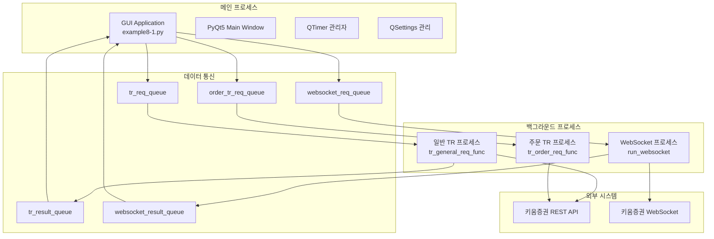
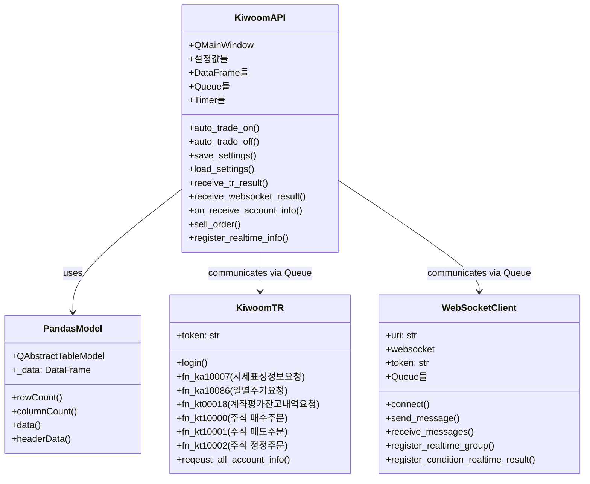
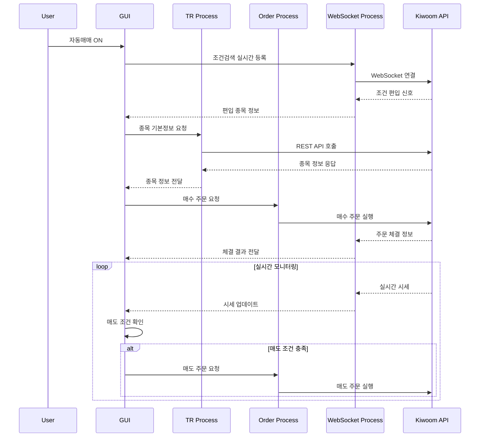
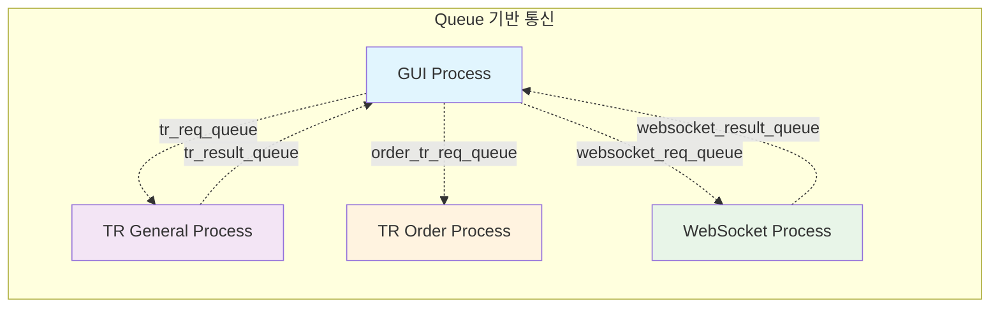
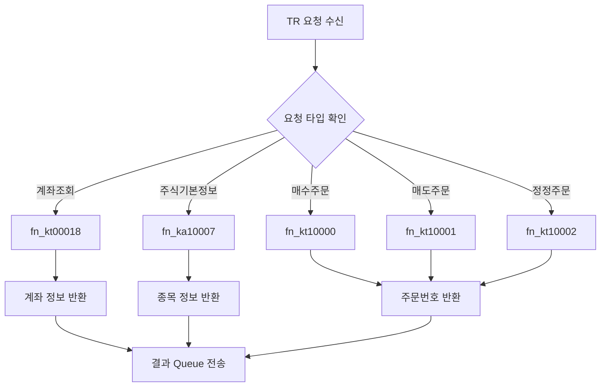
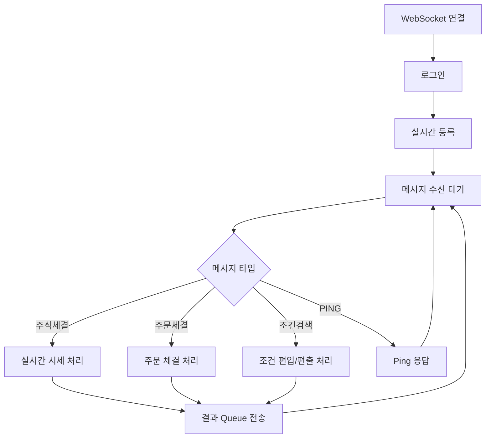
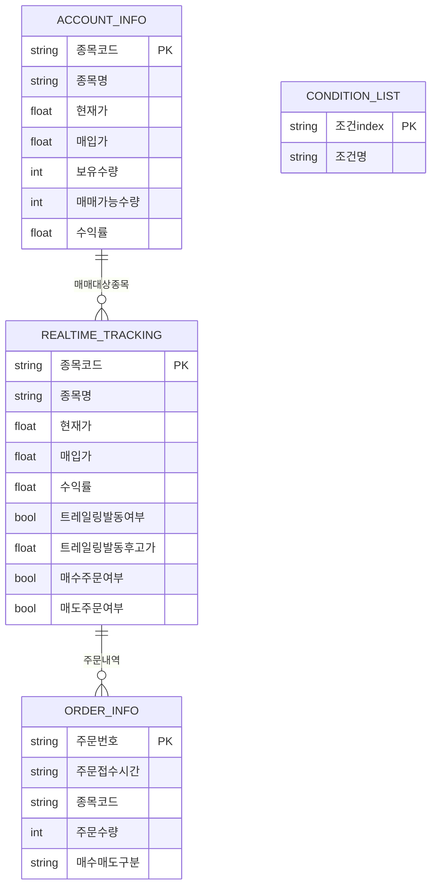
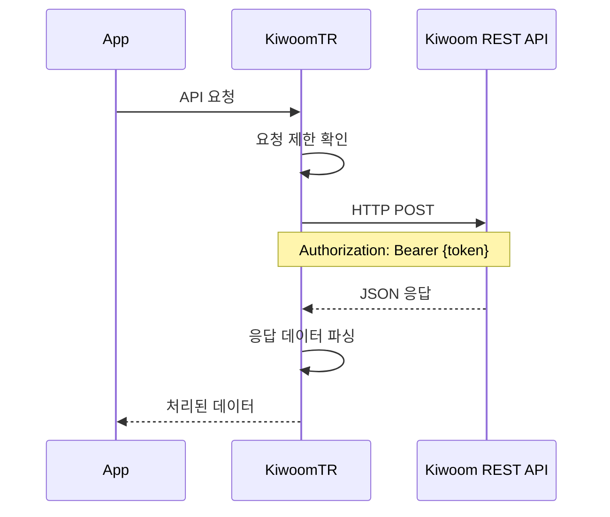
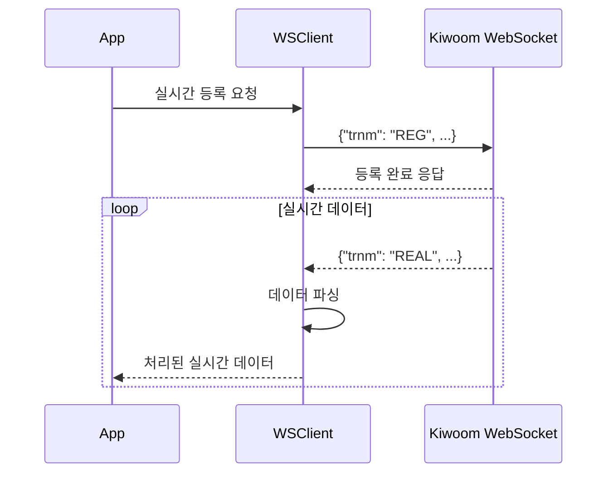

# 키움증권 자동매매 시스템 아키텍처 및 다이어그램

## 1. 전체 시스템 아키텍처



## 2. 클래스 구조 다이어그램



## 3. 데이터 흐름 다이어그램



## 4. 프로세스 간 통신 구조



## 5. 주요 함수별 기능 맵

### 5.1 GUI 메인 클래스 (KiwoomAPI)

```mermaid
mindmap
  root((KiwoomAPI))
    초기화
      setupUi()
      load_settings()
      Timer 설정
      Queue 연결
    자동매매 제어
      auto_trade_on()
      auto_trade_off()
      check_valid_time()
    데이터 처리
      receive_tr_result()
      receive_websocket_result()
      on_receive_account_info()
      on_receive_realtime_tick()
    주문 관리
      sell_order()
      check_amend_orders()
      on_receive_order_result()
    UI 관리
      update_pandas_models()
      save_settings()
      format_number()
```

### 5.2 TR 처리 함수들



### 5.3 WebSocket 처리 구조



## 6. 데이터 모델 구조

### 6.1 주요 DataFrame 구조



## 7. API 통신 구조

### 7.1 REST API 통신



### 7.2 WebSocket 통신



## 8. 타이머 기반 작업 스케줄링

```mermaid
gantt
    title 타이머 기반 작업 스케줄링
    dateFormat X
    axisFormat %L ms
    
    section 실시간 처리
    WebSocket 결과 수신     :0, 10
    
    section 일반 처리
    TR 결과 수신           :0, 100
    미체결 주문 확인        :0, 1000
    화면 업데이트          :0, 1000
    거래시간 확인          :0, 1000
    
    section 데이터 저장
    Pickle 파일 저장       :0, 5000
```



이 아키텍처는 멀티프로세싱을 통한 안정성과 실시간 처리 성능을 동시에 확보하면서, 체계적인 데이터 관리와 사용자 친화적인 인터페이스를 제공하도록 설계되었습니다.